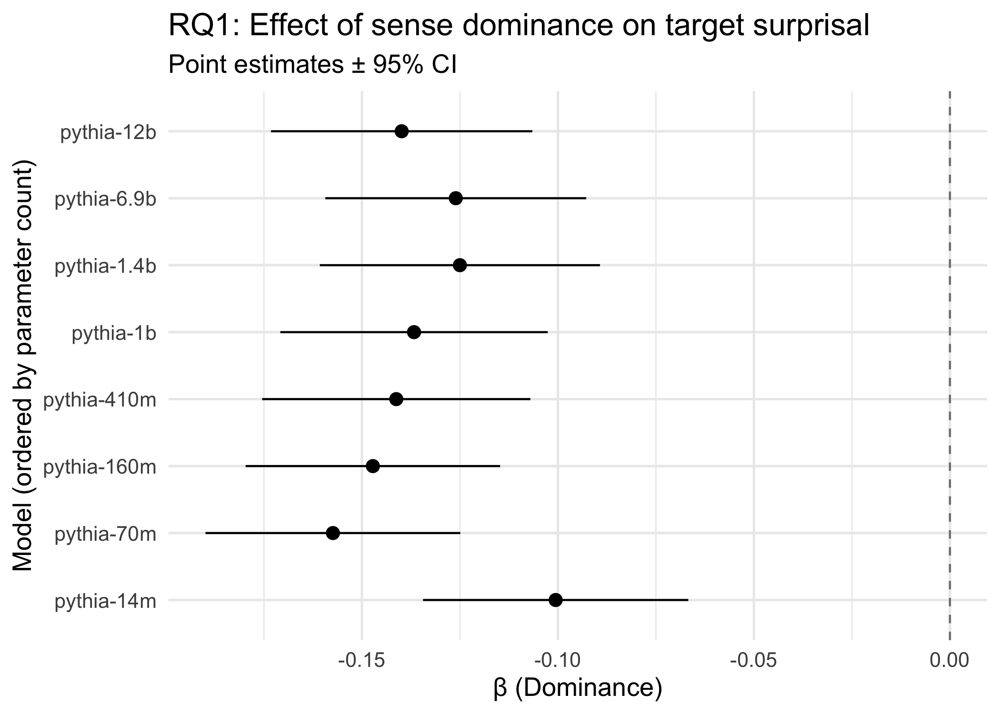
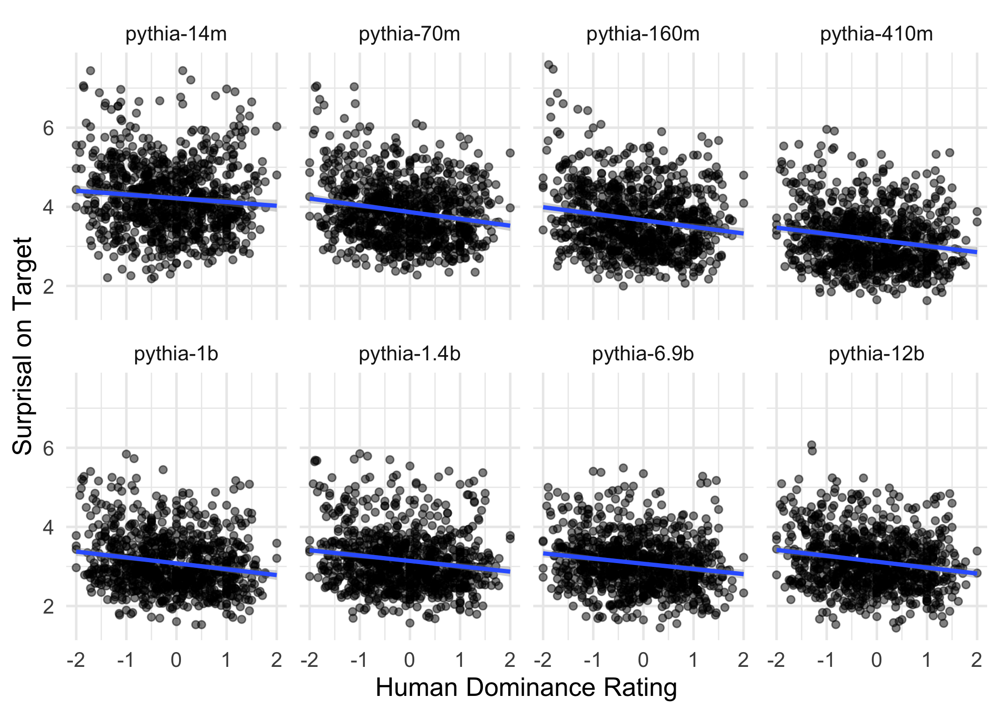
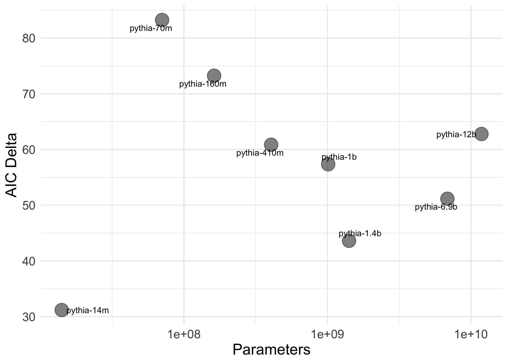
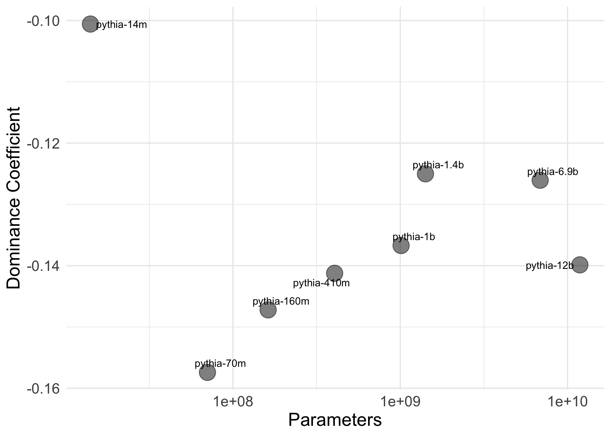
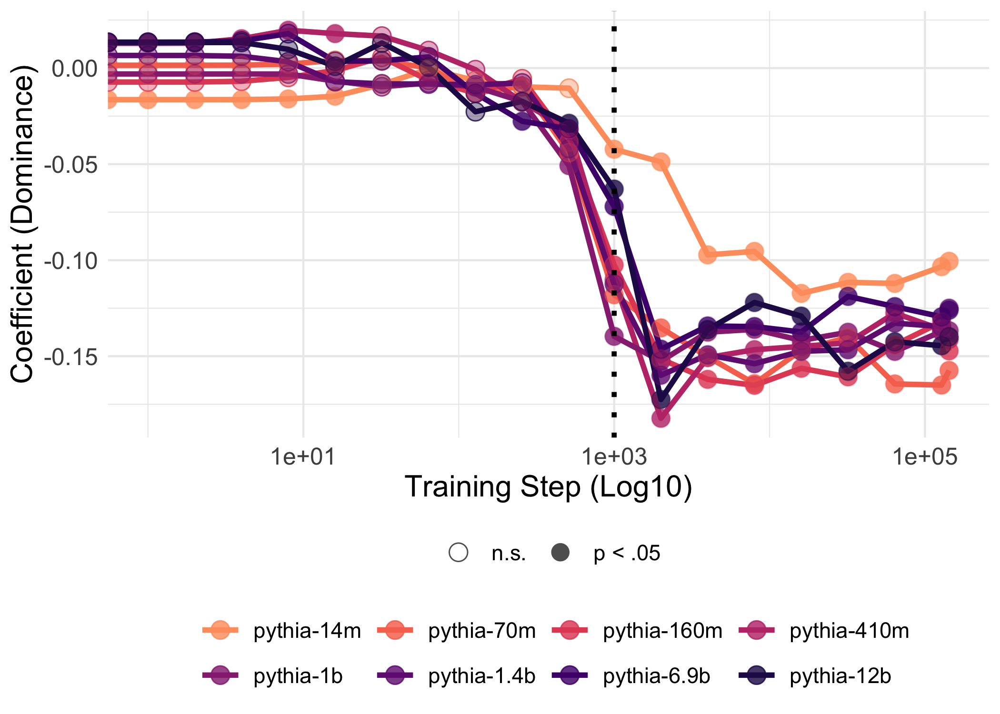
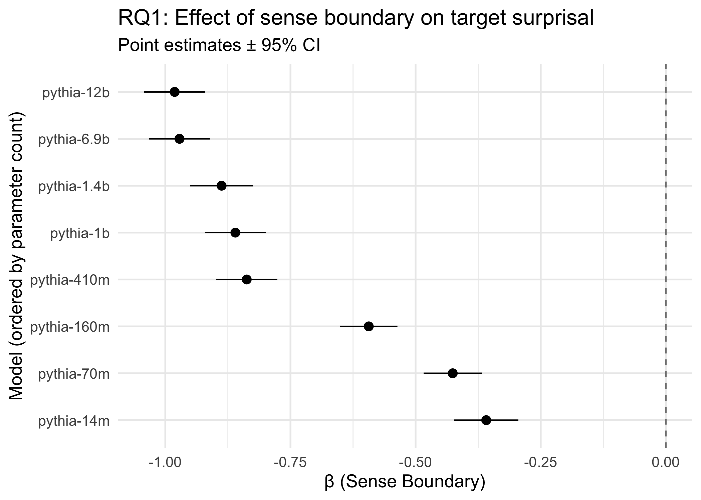
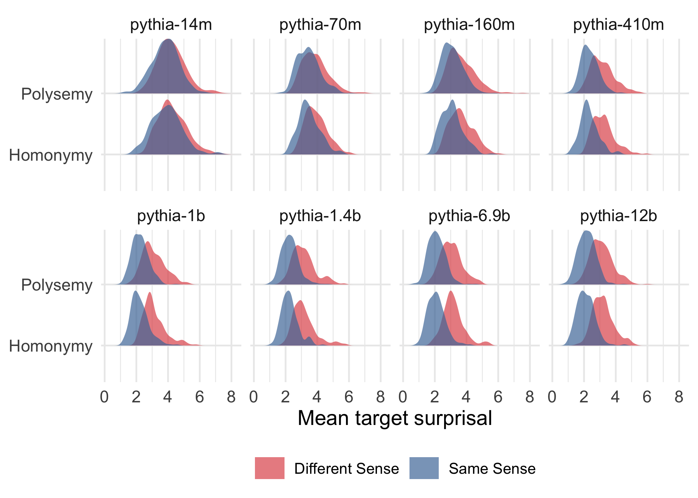
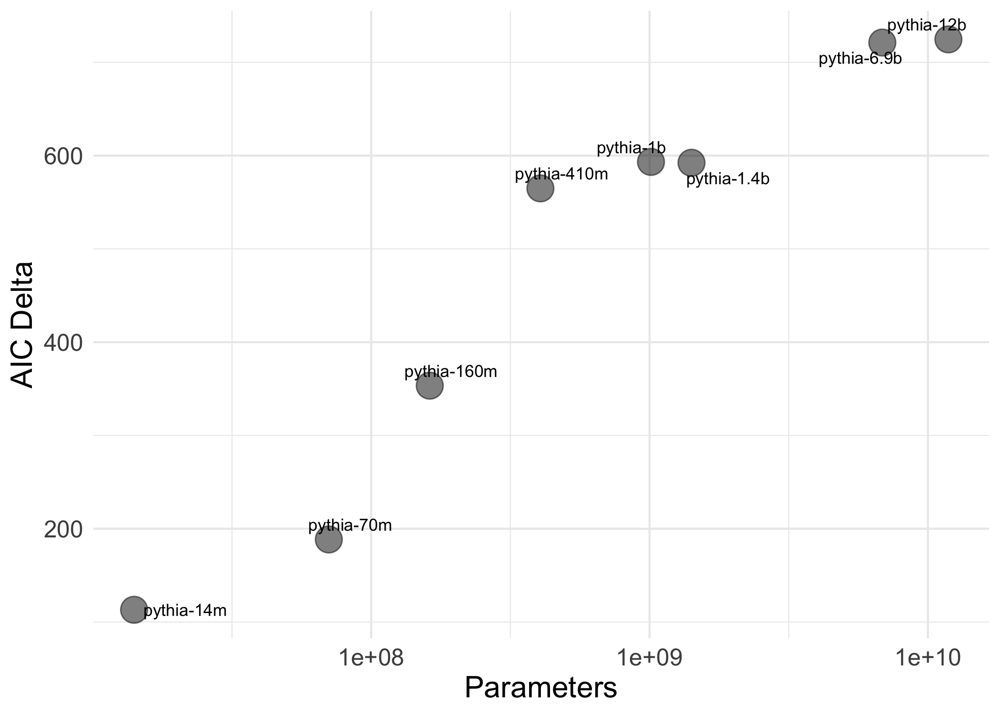
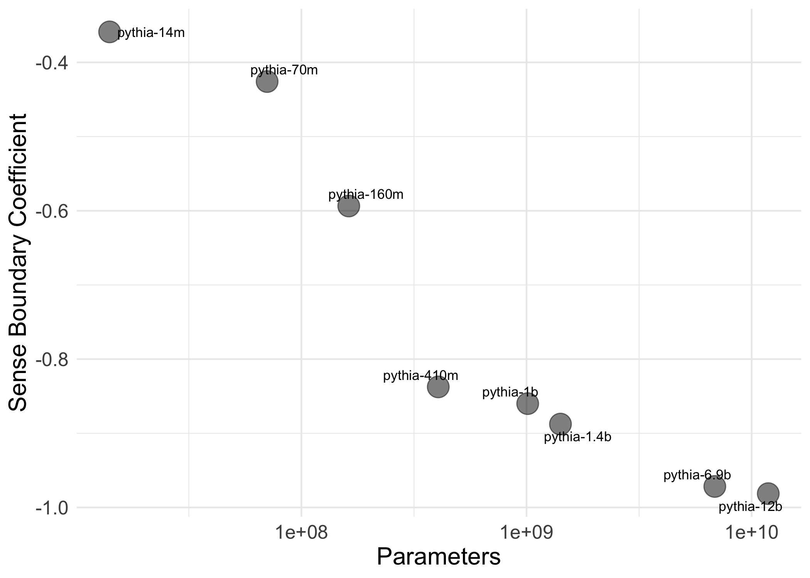
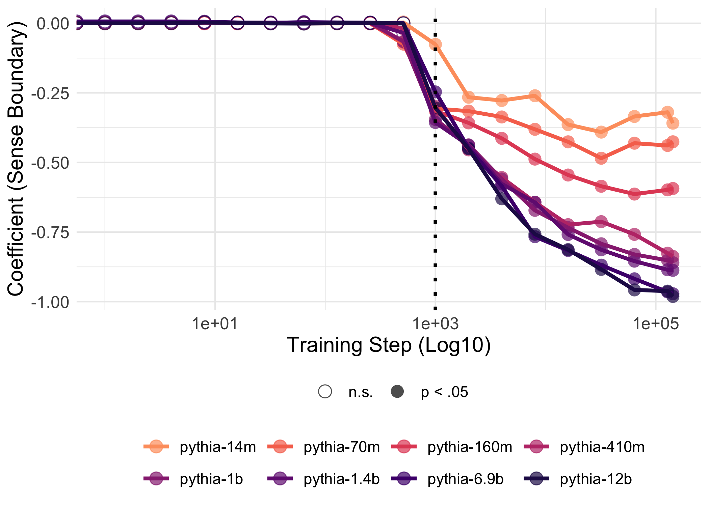

# Setup

Load libraries


``` r
library(tidyverse)
```

```
## ── Attaching core tidyverse packages ──────────────────────── tidyverse 2.0.0 ──
## ✔ dplyr     1.1.4     ✔ readr     2.1.5
## ✔ forcats   1.0.0     ✔ stringr   1.5.1
## ✔ ggplot2   3.5.2     ✔ tibble    3.2.1
## ✔ lubridate 1.9.4     ✔ tidyr     1.3.1
## ✔ purrr     1.0.4     
## ── Conflicts ────────────────────────────────────────── tidyverse_conflicts() ──
## ✖ dplyr::filter() masks stats::filter()
## ✖ dplyr::lag()    masks stats::lag()
## ℹ Use the conflicted package (<http://conflicted.r-lib.org/>) to force all conflicts to become errors
```

``` r
library(lme4)
```

```
## Loading required package: Matrix
## 
## Attaching package: 'Matrix'
## 
## The following objects are masked from 'package:tidyr':
## 
##     expand, pack, unpack
```

``` r
library(broom.mixed)
library(lmerTest)
```

```
## 
## Attaching package: 'lmerTest'
## 
## The following object is masked from 'package:lme4':
## 
##     lmer
## 
## The following object is masked from 'package:stats':
## 
##     step
```

``` r
library(kableExtra)
```

```
## 
## Attaching package: 'kableExtra'
## 
## The following object is masked from 'package:dplyr':
## 
##     group_rows
```

``` r
library(ggridges)
library(ggrepel)
```


# Load data


``` r
# setwd("/Users/seantrott/Dropbox/UCSD/Research/Ambiguity/SSD/llm_sbe/src/analysis")

# df_pythia = read_csv("../../data/processed/rawc/pythia-14m_surprisals.csv")
### First, load all pythia models
directory_path <- "../../data/processed/rawc/"
csv_files <- list.files(path = directory_path, pattern = "*.csv", full.names = TRUE)
csv_list <- csv_files %>%
  map(~ read_csv(.))
```

```
## Rows: 1344 Columns: 22
## ── Column specification ────────────────────────────────────────────────────────
## Delimiter: ","
## chr (15): word, ambiguity_type, string, version, Class, order, version_with_...
## dbl  (6): target_surprisal_sum, target_surprisal_mean, final_token_surprisal...
## lgl  (1): same
## 
## ℹ Use `spec()` to retrieve the full column specification for this data.
## ℹ Specify the column types or set `show_col_types = FALSE` to quiet this message.
## Rows: 1344 Columns: 22
## ── Column specification ────────────────────────────────────────────────────────
## Delimiter: ","
## chr (15): word, ambiguity_type, string, version, Class, order, version_with_...
## dbl  (6): target_surprisal_sum, target_surprisal_mean, final_token_surprisal...
## lgl  (1): same
## 
## ℹ Use `spec()` to retrieve the full column specification for this data.
## ℹ Specify the column types or set `show_col_types = FALSE` to quiet this message.
## Rows: 1344 Columns: 22
## ── Column specification ────────────────────────────────────────────────────────
## Delimiter: ","
## chr (15): word, ambiguity_type, string, version, Class, order, version_with_...
## dbl  (6): target_surprisal_sum, target_surprisal_mean, final_token_surprisal...
## lgl  (1): same
## 
## ℹ Use `spec()` to retrieve the full column specification for this data.
## ℹ Specify the column types or set `show_col_types = FALSE` to quiet this message.
## Rows: 1344 Columns: 22
## ── Column specification ────────────────────────────────────────────────────────
## Delimiter: ","
## chr (15): word, ambiguity_type, string, version, Class, order, version_with_...
## dbl  (6): target_surprisal_sum, target_surprisal_mean, final_token_surprisal...
## lgl  (1): same
## 
## ℹ Use `spec()` to retrieve the full column specification for this data.
## ℹ Specify the column types or set `show_col_types = FALSE` to quiet this message.
## Rows: 1344 Columns: 22
## ── Column specification ────────────────────────────────────────────────────────
## Delimiter: ","
## chr (15): word, ambiguity_type, string, version, Class, order, version_with_...
## dbl  (6): target_surprisal_sum, target_surprisal_mean, final_token_surprisal...
## lgl  (1): same
## 
## ℹ Use `spec()` to retrieve the full column specification for this data.
## ℹ Specify the column types or set `show_col_types = FALSE` to quiet this message.
## Rows: 1344 Columns: 22
## ── Column specification ────────────────────────────────────────────────────────
## Delimiter: ","
## chr (15): word, ambiguity_type, string, version, Class, order, version_with_...
## dbl  (6): target_surprisal_sum, target_surprisal_mean, final_token_surprisal...
## lgl  (1): same
## 
## ℹ Use `spec()` to retrieve the full column specification for this data.
## ℹ Specify the column types or set `show_col_types = FALSE` to quiet this message.
## Rows: 1344 Columns: 22
## ── Column specification ────────────────────────────────────────────────────────
## Delimiter: ","
## chr (15): word, ambiguity_type, string, version, Class, order, version_with_...
## dbl  (6): target_surprisal_sum, target_surprisal_mean, final_token_surprisal...
## lgl  (1): same
## 
## ℹ Use `spec()` to retrieve the full column specification for this data.
## ℹ Specify the column types or set `show_col_types = FALSE` to quiet this message.
## Rows: 1344 Columns: 22
## ── Column specification ────────────────────────────────────────────────────────
## Delimiter: ","
## chr (15): word, ambiguity_type, string, version, Class, order, version_with_...
## dbl  (6): target_surprisal_sum, target_surprisal_mean, final_token_surprisal...
## lgl  (1): same
## 
## ℹ Use `spec()` to retrieve the full column specification for this data.
## ℹ Specify the column types or set `show_col_types = FALSE` to quiet this message.
## Rows: 1344 Columns: 22
## ── Column specification ────────────────────────────────────────────────────────
## Delimiter: ","
## chr (15): word, ambiguity_type, string, version, Class, order, version_with_...
## dbl  (6): target_surprisal_sum, target_surprisal_mean, final_token_surprisal...
## lgl  (1): same
## 
## ℹ Use `spec()` to retrieve the full column specification for this data.
## ℹ Specify the column types or set `show_col_types = FALSE` to quiet this message.
## Rows: 1344 Columns: 22
## ── Column specification ────────────────────────────────────────────────────────
## Delimiter: ","
## chr (15): word, ambiguity_type, string, version, Class, order, version_with_...
## dbl  (6): target_surprisal_sum, target_surprisal_mean, final_token_surprisal...
## lgl  (1): same
## 
## ℹ Use `spec()` to retrieve the full column specification for this data.
## ℹ Specify the column types or set `show_col_types = FALSE` to quiet this message.
## Rows: 1344 Columns: 22
## ── Column specification ────────────────────────────────────────────────────────
## Delimiter: ","
## chr (15): word, ambiguity_type, string, version, Class, order, version_with_...
## dbl  (6): target_surprisal_sum, target_surprisal_mean, final_token_surprisal...
## lgl  (1): same
## 
## ℹ Use `spec()` to retrieve the full column specification for this data.
## ℹ Specify the column types or set `show_col_types = FALSE` to quiet this message.
## Rows: 1344 Columns: 22
## ── Column specification ────────────────────────────────────────────────────────
## Delimiter: ","
## chr (15): word, ambiguity_type, string, version, Class, order, version_with_...
## dbl  (6): target_surprisal_sum, target_surprisal_mean, final_token_surprisal...
## lgl  (1): same
## 
## ℹ Use `spec()` to retrieve the full column specification for this data.
## ℹ Specify the column types or set `show_col_types = FALSE` to quiet this message.
## Rows: 1344 Columns: 22
## ── Column specification ────────────────────────────────────────────────────────
## Delimiter: ","
## chr (15): word, ambiguity_type, string, version, Class, order, version_with_...
## dbl  (6): target_surprisal_sum, target_surprisal_mean, final_token_surprisal...
## lgl  (1): same
## 
## ℹ Use `spec()` to retrieve the full column specification for this data.
## ℹ Specify the column types or set `show_col_types = FALSE` to quiet this message.
## Rows: 1344 Columns: 22
## ── Column specification ────────────────────────────────────────────────────────
## Delimiter: ","
## chr (15): word, ambiguity_type, string, version, Class, order, version_with_...
## dbl  (6): target_surprisal_sum, target_surprisal_mean, final_token_surprisal...
## lgl  (1): same
## 
## ℹ Use `spec()` to retrieve the full column specification for this data.
## ℹ Specify the column types or set `show_col_types = FALSE` to quiet this message.
## Rows: 1344 Columns: 22
## ── Column specification ────────────────────────────────────────────────────────
## Delimiter: ","
## chr (15): word, ambiguity_type, string, version, Class, order, version_with_...
## dbl  (6): target_surprisal_sum, target_surprisal_mean, final_token_surprisal...
## lgl  (1): same
## 
## ℹ Use `spec()` to retrieve the full column specification for this data.
## ℹ Specify the column types or set `show_col_types = FALSE` to quiet this message.
## Rows: 1344 Columns: 22
## ── Column specification ────────────────────────────────────────────────────────
## Delimiter: ","
## chr (15): word, ambiguity_type, string, version, Class, order, version_with_...
## dbl  (6): target_surprisal_sum, target_surprisal_mean, final_token_surprisal...
## lgl  (1): same
## 
## ℹ Use `spec()` to retrieve the full column specification for this data.
## ℹ Specify the column types or set `show_col_types = FALSE` to quiet this message.
## Rows: 1344 Columns: 22
## ── Column specification ────────────────────────────────────────────────────────
## Delimiter: ","
## chr (15): word, ambiguity_type, string, version, Class, order, version_with_...
## dbl  (6): target_surprisal_sum, target_surprisal_mean, final_token_surprisal...
## lgl  (1): same
## 
## ℹ Use `spec()` to retrieve the full column specification for this data.
## ℹ Specify the column types or set `show_col_types = FALSE` to quiet this message.
## Rows: 1344 Columns: 22
## ── Column specification ────────────────────────────────────────────────────────
## Delimiter: ","
## chr (15): word, ambiguity_type, string, version, Class, order, version_with_...
## dbl  (6): target_surprisal_sum, target_surprisal_mean, final_token_surprisal...
## lgl  (1): same
## 
## ℹ Use `spec()` to retrieve the full column specification for this data.
## ℹ Specify the column types or set `show_col_types = FALSE` to quiet this message.
## Rows: 1344 Columns: 22
## ── Column specification ────────────────────────────────────────────────────────
## Delimiter: ","
## chr (15): word, ambiguity_type, string, version, Class, order, version_with_...
## dbl  (6): target_surprisal_sum, target_surprisal_mean, final_token_surprisal...
## lgl  (1): same
## 
## ℹ Use `spec()` to retrieve the full column specification for this data.
## ℹ Specify the column types or set `show_col_types = FALSE` to quiet this message.
## Rows: 1344 Columns: 22
## ── Column specification ────────────────────────────────────────────────────────
## Delimiter: ","
## chr (15): word, ambiguity_type, string, version, Class, order, version_with_...
## dbl  (6): target_surprisal_sum, target_surprisal_mean, final_token_surprisal...
## lgl  (1): same
## 
## ℹ Use `spec()` to retrieve the full column specification for this data.
## ℹ Specify the column types or set `show_col_types = FALSE` to quiet this message.
## Rows: 1344 Columns: 22
## ── Column specification ────────────────────────────────────────────────────────
## Delimiter: ","
## chr (15): word, ambiguity_type, string, version, Class, order, version_with_...
## dbl  (6): target_surprisal_sum, target_surprisal_mean, final_token_surprisal...
## lgl  (1): same
## 
## ℹ Use `spec()` to retrieve the full column specification for this data.
## ℹ Specify the column types or set `show_col_types = FALSE` to quiet this message.
## Rows: 1344 Columns: 22
## ── Column specification ────────────────────────────────────────────────────────
## Delimiter: ","
## chr (15): word, ambiguity_type, string, version, Class, order, version_with_...
## dbl  (6): target_surprisal_sum, target_surprisal_mean, final_token_surprisal...
## lgl  (1): same
## 
## ℹ Use `spec()` to retrieve the full column specification for this data.
## ℹ Specify the column types or set `show_col_types = FALSE` to quiet this message.
## Rows: 1344 Columns: 22
## ── Column specification ────────────────────────────────────────────────────────
## Delimiter: ","
## chr (15): word, ambiguity_type, string, version, Class, order, version_with_...
## dbl  (6): target_surprisal_sum, target_surprisal_mean, final_token_surprisal...
## lgl  (1): same
## 
## ℹ Use `spec()` to retrieve the full column specification for this data.
## ℹ Specify the column types or set `show_col_types = FALSE` to quiet this message.
## Rows: 1344 Columns: 22
## ── Column specification ────────────────────────────────────────────────────────
## Delimiter: ","
## chr (15): word, ambiguity_type, string, version, Class, order, version_with_...
## dbl  (6): target_surprisal_sum, target_surprisal_mean, final_token_surprisal...
## lgl  (1): same
## 
## ℹ Use `spec()` to retrieve the full column specification for this data.
## ℹ Specify the column types or set `show_col_types = FALSE` to quiet this message.
## Rows: 1344 Columns: 22
## ── Column specification ────────────────────────────────────────────────────────
## Delimiter: ","
## chr (15): word, ambiguity_type, string, version, Class, order, version_with_...
## dbl  (6): target_surprisal_sum, target_surprisal_mean, final_token_surprisal...
## lgl  (1): same
## 
## ℹ Use `spec()` to retrieve the full column specification for this data.
## ℹ Specify the column types or set `show_col_types = FALSE` to quiet this message.
## Rows: 1344 Columns: 22
## ── Column specification ────────────────────────────────────────────────────────
## Delimiter: ","
## chr (15): word, ambiguity_type, string, version, Class, order, version_with_...
## dbl  (6): target_surprisal_sum, target_surprisal_mean, final_token_surprisal...
## lgl  (1): same
## 
## ℹ Use `spec()` to retrieve the full column specification for this data.
## ℹ Specify the column types or set `show_col_types = FALSE` to quiet this message.
## Rows: 1344 Columns: 22
## ── Column specification ────────────────────────────────────────────────────────
## Delimiter: ","
## chr (15): word, ambiguity_type, string, version, Class, order, version_with_...
## dbl  (6): target_surprisal_sum, target_surprisal_mean, final_token_surprisal...
## lgl  (1): same
## 
## ℹ Use `spec()` to retrieve the full column specification for this data.
## ℹ Specify the column types or set `show_col_types = FALSE` to quiet this message.
## Rows: 1344 Columns: 22
## ── Column specification ────────────────────────────────────────────────────────
## Delimiter: ","
## chr (15): word, ambiguity_type, string, version, Class, order, version_with_...
## dbl  (6): target_surprisal_sum, target_surprisal_mean, final_token_surprisal...
## lgl  (1): same
## 
## ℹ Use `spec()` to retrieve the full column specification for this data.
## ℹ Specify the column types or set `show_col_types = FALSE` to quiet this message.
## Rows: 1344 Columns: 22
## ── Column specification ────────────────────────────────────────────────────────
## Delimiter: ","
## chr (15): word, ambiguity_type, string, version, Class, order, version_with_...
## dbl  (6): target_surprisal_sum, target_surprisal_mean, final_token_surprisal...
## lgl  (1): same
## 
## ℹ Use `spec()` to retrieve the full column specification for this data.
## ℹ Specify the column types or set `show_col_types = FALSE` to quiet this message.
## Rows: 1344 Columns: 22
## ── Column specification ────────────────────────────────────────────────────────
## Delimiter: ","
## chr (15): word, ambiguity_type, string, version, Class, order, version_with_...
## dbl  (6): target_surprisal_sum, target_surprisal_mean, final_token_surprisal...
## lgl  (1): same
## 
## ℹ Use `spec()` to retrieve the full column specification for this data.
## ℹ Specify the column types or set `show_col_types = FALSE` to quiet this message.
## Rows: 1344 Columns: 22
## ── Column specification ────────────────────────────────────────────────────────
## Delimiter: ","
## chr (15): word, ambiguity_type, string, version, Class, order, version_with_...
## dbl  (6): target_surprisal_sum, target_surprisal_mean, final_token_surprisal...
## lgl  (1): same
## 
## ℹ Use `spec()` to retrieve the full column specification for this data.
## ℹ Specify the column types or set `show_col_types = FALSE` to quiet this message.
## Rows: 1344 Columns: 22
## ── Column specification ────────────────────────────────────────────────────────
## Delimiter: ","
## chr (15): word, ambiguity_type, string, version, Class, order, version_with_...
## dbl  (6): target_surprisal_sum, target_surprisal_mean, final_token_surprisal...
## lgl  (1): same
## 
## ℹ Use `spec()` to retrieve the full column specification for this data.
## ℹ Specify the column types or set `show_col_types = FALSE` to quiet this message.
## Rows: 1344 Columns: 22
## ── Column specification ────────────────────────────────────────────────────────
## Delimiter: ","
## chr (15): word, ambiguity_type, string, version, Class, order, version_with_...
## dbl  (6): target_surprisal_sum, target_surprisal_mean, final_token_surprisal...
## lgl  (1): same
## 
## ℹ Use `spec()` to retrieve the full column specification for this data.
## ℹ Specify the column types or set `show_col_types = FALSE` to quiet this message.
## Rows: 1344 Columns: 22
## ── Column specification ────────────────────────────────────────────────────────
## Delimiter: ","
## chr (15): word, ambiguity_type, string, version, Class, order, version_with_...
## dbl  (6): target_surprisal_sum, target_surprisal_mean, final_token_surprisal...
## lgl  (1): same
## 
## ℹ Use `spec()` to retrieve the full column specification for this data.
## ℹ Specify the column types or set `show_col_types = FALSE` to quiet this message.
## Rows: 1344 Columns: 22
## ── Column specification ────────────────────────────────────────────────────────
## Delimiter: ","
## chr (15): word, ambiguity_type, string, version, Class, order, version_with_...
## dbl  (6): target_surprisal_sum, target_surprisal_mean, final_token_surprisal...
## lgl  (1): same
## 
## ℹ Use `spec()` to retrieve the full column specification for this data.
## ℹ Specify the column types or set `show_col_types = FALSE` to quiet this message.
## Rows: 1344 Columns: 22
## ── Column specification ────────────────────────────────────────────────────────
## Delimiter: ","
## chr (15): word, ambiguity_type, string, version, Class, order, version_with_...
## dbl  (6): target_surprisal_sum, target_surprisal_mean, final_token_surprisal...
## lgl  (1): same
## 
## ℹ Use `spec()` to retrieve the full column specification for this data.
## ℹ Specify the column types or set `show_col_types = FALSE` to quiet this message.
## Rows: 1344 Columns: 22
## ── Column specification ────────────────────────────────────────────────────────
## Delimiter: ","
## chr (15): word, ambiguity_type, string, version, Class, order, version_with_...
## dbl  (6): target_surprisal_sum, target_surprisal_mean, final_token_surprisal...
## lgl  (1): same
## 
## ℹ Use `spec()` to retrieve the full column specification for this data.
## ℹ Specify the column types or set `show_col_types = FALSE` to quiet this message.
## Rows: 1344 Columns: 22
## ── Column specification ────────────────────────────────────────────────────────
## Delimiter: ","
## chr (15): word, ambiguity_type, string, version, Class, order, version_with_...
## dbl  (6): target_surprisal_sum, target_surprisal_mean, final_token_surprisal...
## lgl  (1): same
## 
## ℹ Use `spec()` to retrieve the full column specification for this data.
## ℹ Specify the column types or set `show_col_types = FALSE` to quiet this message.
## Rows: 1344 Columns: 22
## ── Column specification ────────────────────────────────────────────────────────
## Delimiter: ","
## chr (15): word, ambiguity_type, string, version, Class, order, version_with_...
## dbl  (6): target_surprisal_sum, target_surprisal_mean, final_token_surprisal...
## lgl  (1): same
## 
## ℹ Use `spec()` to retrieve the full column specification for this data.
## ℹ Specify the column types or set `show_col_types = FALSE` to quiet this message.
## Rows: 1344 Columns: 22
## ── Column specification ────────────────────────────────────────────────────────
## Delimiter: ","
## chr (15): word, ambiguity_type, string, version, Class, order, version_with_...
## dbl  (6): target_surprisal_sum, target_surprisal_mean, final_token_surprisal...
## lgl  (1): same
## 
## ℹ Use `spec()` to retrieve the full column specification for this data.
## ℹ Specify the column types or set `show_col_types = FALSE` to quiet this message.
## Rows: 1344 Columns: 22
## ── Column specification ────────────────────────────────────────────────────────
## Delimiter: ","
## chr (15): word, ambiguity_type, string, version, Class, order, version_with_...
## dbl  (6): target_surprisal_sum, target_surprisal_mean, final_token_surprisal...
## lgl  (1): same
## 
## ℹ Use `spec()` to retrieve the full column specification for this data.
## ℹ Specify the column types or set `show_col_types = FALSE` to quiet this message.
## Rows: 1344 Columns: 22
## ── Column specification ────────────────────────────────────────────────────────
## Delimiter: ","
## chr (15): word, ambiguity_type, string, version, Class, order, version_with_...
## dbl  (6): target_surprisal_sum, target_surprisal_mean, final_token_surprisal...
## lgl  (1): same
## 
## ℹ Use `spec()` to retrieve the full column specification for this data.
## ℹ Specify the column types or set `show_col_types = FALSE` to quiet this message.
## Rows: 1344 Columns: 22
## ── Column specification ────────────────────────────────────────────────────────
## Delimiter: ","
## chr (15): word, ambiguity_type, string, version, Class, order, version_with_...
## dbl  (6): target_surprisal_sum, target_surprisal_mean, final_token_surprisal...
## lgl  (1): same
## 
## ℹ Use `spec()` to retrieve the full column specification for this data.
## ℹ Specify the column types or set `show_col_types = FALSE` to quiet this message.
## Rows: 1344 Columns: 22
## ── Column specification ────────────────────────────────────────────────────────
## Delimiter: ","
## chr (15): word, ambiguity_type, string, version, Class, order, version_with_...
## dbl  (6): target_surprisal_sum, target_surprisal_mean, final_token_surprisal...
## lgl  (1): same
## 
## ℹ Use `spec()` to retrieve the full column specification for this data.
## ℹ Specify the column types or set `show_col_types = FALSE` to quiet this message.
## Rows: 1344 Columns: 22
## ── Column specification ────────────────────────────────────────────────────────
## Delimiter: ","
## chr (15): word, ambiguity_type, string, version, Class, order, version_with_...
## dbl  (6): target_surprisal_sum, target_surprisal_mean, final_token_surprisal...
## lgl  (1): same
## 
## ℹ Use `spec()` to retrieve the full column specification for this data.
## ℹ Specify the column types or set `show_col_types = FALSE` to quiet this message.
## Rows: 1344 Columns: 22
## ── Column specification ────────────────────────────────────────────────────────
## Delimiter: ","
## chr (15): word, ambiguity_type, string, version, Class, order, version_with_...
## dbl  (6): target_surprisal_sum, target_surprisal_mean, final_token_surprisal...
## lgl  (1): same
## 
## ℹ Use `spec()` to retrieve the full column specification for this data.
## ℹ Specify the column types or set `show_col_types = FALSE` to quiet this message.
## Rows: 1344 Columns: 22
## ── Column specification ────────────────────────────────────────────────────────
## Delimiter: ","
## chr (15): word, ambiguity_type, string, version, Class, order, version_with_...
## dbl  (6): target_surprisal_sum, target_surprisal_mean, final_token_surprisal...
## lgl  (1): same
## 
## ℹ Use `spec()` to retrieve the full column specification for this data.
## ℹ Specify the column types or set `show_col_types = FALSE` to quiet this message.
## Rows: 1344 Columns: 22
## ── Column specification ────────────────────────────────────────────────────────
## Delimiter: ","
## chr (15): word, ambiguity_type, string, version, Class, order, version_with_...
## dbl  (6): target_surprisal_sum, target_surprisal_mean, final_token_surprisal...
## lgl  (1): same
## 
## ℹ Use `spec()` to retrieve the full column specification for this data.
## ℹ Specify the column types or set `show_col_types = FALSE` to quiet this message.
## Rows: 1344 Columns: 22
## ── Column specification ────────────────────────────────────────────────────────
## Delimiter: ","
## chr (15): word, ambiguity_type, string, version, Class, order, version_with_...
## dbl  (6): target_surprisal_sum, target_surprisal_mean, final_token_surprisal...
## lgl  (1): same
## 
## ℹ Use `spec()` to retrieve the full column specification for this data.
## ℹ Specify the column types or set `show_col_types = FALSE` to quiet this message.
## Rows: 1344 Columns: 22
## ── Column specification ────────────────────────────────────────────────────────
## Delimiter: ","
## chr (15): word, ambiguity_type, string, version, Class, order, version_with_...
## dbl  (6): target_surprisal_sum, target_surprisal_mean, final_token_surprisal...
## lgl  (1): same
## 
## ℹ Use `spec()` to retrieve the full column specification for this data.
## ℹ Specify the column types or set `show_col_types = FALSE` to quiet this message.
## Rows: 1344 Columns: 22
## ── Column specification ────────────────────────────────────────────────────────
## Delimiter: ","
## chr (15): word, ambiguity_type, string, version, Class, order, version_with_...
## dbl  (6): target_surprisal_sum, target_surprisal_mean, final_token_surprisal...
## lgl  (1): same
## 
## ℹ Use `spec()` to retrieve the full column specification for this data.
## ℹ Specify the column types or set `show_col_types = FALSE` to quiet this message.
## Rows: 1344 Columns: 22
## ── Column specification ────────────────────────────────────────────────────────
## Delimiter: ","
## chr (15): word, ambiguity_type, string, version, Class, order, version_with_...
## dbl  (6): target_surprisal_sum, target_surprisal_mean, final_token_surprisal...
## lgl  (1): same
## 
## ℹ Use `spec()` to retrieve the full column specification for this data.
## ℹ Specify the column types or set `show_col_types = FALSE` to quiet this message.
## Rows: 1344 Columns: 22
## ── Column specification ────────────────────────────────────────────────────────
## Delimiter: ","
## chr (15): word, ambiguity_type, string, version, Class, order, version_with_...
## dbl  (6): target_surprisal_sum, target_surprisal_mean, final_token_surprisal...
## lgl  (1): same
## 
## ℹ Use `spec()` to retrieve the full column specification for this data.
## ℹ Specify the column types or set `show_col_types = FALSE` to quiet this message.
## Rows: 1344 Columns: 22
## ── Column specification ────────────────────────────────────────────────────────
## Delimiter: ","
## chr (15): word, ambiguity_type, string, version, Class, order, version_with_...
## dbl  (6): target_surprisal_sum, target_surprisal_mean, final_token_surprisal...
## lgl  (1): same
## 
## ℹ Use `spec()` to retrieve the full column specification for this data.
## ℹ Specify the column types or set `show_col_types = FALSE` to quiet this message.
## Rows: 1344 Columns: 22
## ── Column specification ────────────────────────────────────────────────────────
## Delimiter: ","
## chr (15): word, ambiguity_type, string, version, Class, order, version_with_...
## dbl  (6): target_surprisal_sum, target_surprisal_mean, final_token_surprisal...
## lgl  (1): same
## 
## ℹ Use `spec()` to retrieve the full column specification for this data.
## ℹ Specify the column types or set `show_col_types = FALSE` to quiet this message.
## Rows: 1344 Columns: 22
## ── Column specification ────────────────────────────────────────────────────────
## Delimiter: ","
## chr (15): word, ambiguity_type, string, version, Class, order, version_with_...
## dbl  (6): target_surprisal_sum, target_surprisal_mean, final_token_surprisal...
## lgl  (1): same
## 
## ℹ Use `spec()` to retrieve the full column specification for this data.
## ℹ Specify the column types or set `show_col_types = FALSE` to quiet this message.
## Rows: 1344 Columns: 22
## ── Column specification ────────────────────────────────────────────────────────
## Delimiter: ","
## chr (15): word, ambiguity_type, string, version, Class, order, version_with_...
## dbl  (6): target_surprisal_sum, target_surprisal_mean, final_token_surprisal...
## lgl  (1): same
## 
## ℹ Use `spec()` to retrieve the full column specification for this data.
## ℹ Specify the column types or set `show_col_types = FALSE` to quiet this message.
## Rows: 1344 Columns: 22
## ── Column specification ────────────────────────────────────────────────────────
## Delimiter: ","
## chr (15): word, ambiguity_type, string, version, Class, order, version_with_...
## dbl  (6): target_surprisal_sum, target_surprisal_mean, final_token_surprisal...
## lgl  (1): same
## 
## ℹ Use `spec()` to retrieve the full column specification for this data.
## ℹ Specify the column types or set `show_col_types = FALSE` to quiet this message.
## Rows: 1344 Columns: 22
## ── Column specification ────────────────────────────────────────────────────────
## Delimiter: ","
## chr (15): word, ambiguity_type, string, version, Class, order, version_with_...
## dbl  (6): target_surprisal_sum, target_surprisal_mean, final_token_surprisal...
## lgl  (1): same
## 
## ℹ Use `spec()` to retrieve the full column specification for this data.
## ℹ Specify the column types or set `show_col_types = FALSE` to quiet this message.
## Rows: 1344 Columns: 22
## ── Column specification ────────────────────────────────────────────────────────
## Delimiter: ","
## chr (15): word, ambiguity_type, string, version, Class, order, version_with_...
## dbl  (6): target_surprisal_sum, target_surprisal_mean, final_token_surprisal...
## lgl  (1): same
## 
## ℹ Use `spec()` to retrieve the full column specification for this data.
## ℹ Specify the column types or set `show_col_types = FALSE` to quiet this message.
## Rows: 1344 Columns: 22
## ── Column specification ────────────────────────────────────────────────────────
## Delimiter: ","
## chr (15): word, ambiguity_type, string, version, Class, order, version_with_...
## dbl  (6): target_surprisal_sum, target_surprisal_mean, final_token_surprisal...
## lgl  (1): same
## 
## ℹ Use `spec()` to retrieve the full column specification for this data.
## ℹ Specify the column types or set `show_col_types = FALSE` to quiet this message.
## Rows: 1344 Columns: 22
## ── Column specification ────────────────────────────────────────────────────────
## Delimiter: ","
## chr (15): word, ambiguity_type, string, version, Class, order, version_with_...
## dbl  (6): target_surprisal_sum, target_surprisal_mean, final_token_surprisal...
## lgl  (1): same
## 
## ℹ Use `spec()` to retrieve the full column specification for this data.
## ℹ Specify the column types or set `show_col_types = FALSE` to quiet this message.
## Rows: 1344 Columns: 22
## ── Column specification ────────────────────────────────────────────────────────
## Delimiter: ","
## chr (15): word, ambiguity_type, string, version, Class, order, version_with_...
## dbl  (6): target_surprisal_sum, target_surprisal_mean, final_token_surprisal...
## lgl  (1): same
## 
## ℹ Use `spec()` to retrieve the full column specification for this data.
## ℹ Specify the column types or set `show_col_types = FALSE` to quiet this message.
## Rows: 1344 Columns: 22
## ── Column specification ────────────────────────────────────────────────────────
## Delimiter: ","
## chr (15): word, ambiguity_type, string, version, Class, order, version_with_...
## dbl  (6): target_surprisal_sum, target_surprisal_mean, final_token_surprisal...
## lgl  (1): same
## 
## ℹ Use `spec()` to retrieve the full column specification for this data.
## ℹ Specify the column types or set `show_col_types = FALSE` to quiet this message.
## Rows: 1344 Columns: 22
## ── Column specification ────────────────────────────────────────────────────────
## Delimiter: ","
## chr (15): word, ambiguity_type, string, version, Class, order, version_with_...
## dbl  (6): target_surprisal_sum, target_surprisal_mean, final_token_surprisal...
## lgl  (1): same
## 
## ℹ Use `spec()` to retrieve the full column specification for this data.
## ℹ Specify the column types or set `show_col_types = FALSE` to quiet this message.
## Rows: 1344 Columns: 22
## ── Column specification ────────────────────────────────────────────────────────
## Delimiter: ","
## chr (15): word, ambiguity_type, string, version, Class, order, version_with_...
## dbl  (6): target_surprisal_sum, target_surprisal_mean, final_token_surprisal...
## lgl  (1): same
## 
## ℹ Use `spec()` to retrieve the full column specification for this data.
## ℹ Specify the column types or set `show_col_types = FALSE` to quiet this message.
## Rows: 1344 Columns: 22
## ── Column specification ────────────────────────────────────────────────────────
## Delimiter: ","
## chr (15): word, ambiguity_type, string, version, Class, order, version_with_...
## dbl  (6): target_surprisal_sum, target_surprisal_mean, final_token_surprisal...
## lgl  (1): same
## 
## ℹ Use `spec()` to retrieve the full column specification for this data.
## ℹ Specify the column types or set `show_col_types = FALSE` to quiet this message.
## Rows: 1344 Columns: 22
## ── Column specification ────────────────────────────────────────────────────────
## Delimiter: ","
## chr (15): word, ambiguity_type, string, version, Class, order, version_with_...
## dbl  (6): target_surprisal_sum, target_surprisal_mean, final_token_surprisal...
## lgl  (1): same
## 
## ℹ Use `spec()` to retrieve the full column specification for this data.
## ℹ Specify the column types or set `show_col_types = FALSE` to quiet this message.
## Rows: 1344 Columns: 22
## ── Column specification ────────────────────────────────────────────────────────
## Delimiter: ","
## chr (15): word, ambiguity_type, string, version, Class, order, version_with_...
## dbl  (6): target_surprisal_sum, target_surprisal_mean, final_token_surprisal...
## lgl  (1): same
## 
## ℹ Use `spec()` to retrieve the full column specification for this data.
## ℹ Specify the column types or set `show_col_types = FALSE` to quiet this message.
## Rows: 1344 Columns: 22
## ── Column specification ────────────────────────────────────────────────────────
## Delimiter: ","
## chr (15): word, ambiguity_type, string, version, Class, order, version_with_...
## dbl  (6): target_surprisal_sum, target_surprisal_mean, final_token_surprisal...
## lgl  (1): same
## 
## ℹ Use `spec()` to retrieve the full column specification for this data.
## ℹ Specify the column types or set `show_col_types = FALSE` to quiet this message.
## Rows: 1344 Columns: 22
## ── Column specification ────────────────────────────────────────────────────────
## Delimiter: ","
## chr (15): word, ambiguity_type, string, version, Class, order, version_with_...
## dbl  (6): target_surprisal_sum, target_surprisal_mean, final_token_surprisal...
## lgl  (1): same
## 
## ℹ Use `spec()` to retrieve the full column specification for this data.
## ℹ Specify the column types or set `show_col_types = FALSE` to quiet this message.
## Rows: 1344 Columns: 22
## ── Column specification ────────────────────────────────────────────────────────
## Delimiter: ","
## chr (15): word, ambiguity_type, string, version, Class, order, version_with_...
## dbl  (6): target_surprisal_sum, target_surprisal_mean, final_token_surprisal...
## lgl  (1): same
## 
## ℹ Use `spec()` to retrieve the full column specification for this data.
## ℹ Specify the column types or set `show_col_types = FALSE` to quiet this message.
## Rows: 1344 Columns: 22
## ── Column specification ────────────────────────────────────────────────────────
## Delimiter: ","
## chr (15): word, ambiguity_type, string, version, Class, order, version_with_...
## dbl  (6): target_surprisal_sum, target_surprisal_mean, final_token_surprisal...
## lgl  (1): same
## 
## ℹ Use `spec()` to retrieve the full column specification for this data.
## ℹ Specify the column types or set `show_col_types = FALSE` to quiet this message.
## Rows: 1344 Columns: 22
## ── Column specification ────────────────────────────────────────────────────────
## Delimiter: ","
## chr (15): word, ambiguity_type, string, version, Class, order, version_with_...
## dbl  (6): target_surprisal_sum, target_surprisal_mean, final_token_surprisal...
## lgl  (1): same
## 
## ℹ Use `spec()` to retrieve the full column specification for this data.
## ℹ Specify the column types or set `show_col_types = FALSE` to quiet this message.
## Rows: 1344 Columns: 22
## ── Column specification ────────────────────────────────────────────────────────
## Delimiter: ","
## chr (15): word, ambiguity_type, string, version, Class, order, version_with_...
## dbl  (6): target_surprisal_sum, target_surprisal_mean, final_token_surprisal...
## lgl  (1): same
## 
## ℹ Use `spec()` to retrieve the full column specification for this data.
## ℹ Specify the column types or set `show_col_types = FALSE` to quiet this message.
## Rows: 1344 Columns: 22
## ── Column specification ────────────────────────────────────────────────────────
## Delimiter: ","
## chr (15): word, ambiguity_type, string, version, Class, order, version_with_...
## dbl  (6): target_surprisal_sum, target_surprisal_mean, final_token_surprisal...
## lgl  (1): same
## 
## ℹ Use `spec()` to retrieve the full column specification for this data.
## ℹ Specify the column types or set `show_col_types = FALSE` to quiet this message.
## Rows: 1344 Columns: 22
## ── Column specification ────────────────────────────────────────────────────────
## Delimiter: ","
## chr (15): word, ambiguity_type, string, version, Class, order, version_with_...
## dbl  (6): target_surprisal_sum, target_surprisal_mean, final_token_surprisal...
## lgl  (1): same
## 
## ℹ Use `spec()` to retrieve the full column specification for this data.
## ℹ Specify the column types or set `show_col_types = FALSE` to quiet this message.
## Rows: 1344 Columns: 22
## ── Column specification ────────────────────────────────────────────────────────
## Delimiter: ","
## chr (15): word, ambiguity_type, string, version, Class, order, version_with_...
## dbl  (6): target_surprisal_sum, target_surprisal_mean, final_token_surprisal...
## lgl  (1): same
## 
## ℹ Use `spec()` to retrieve the full column specification for this data.
## ℹ Specify the column types or set `show_col_types = FALSE` to quiet this message.
## Rows: 1344 Columns: 22
## ── Column specification ────────────────────────────────────────────────────────
## Delimiter: ","
## chr (15): word, ambiguity_type, string, version, Class, order, version_with_...
## dbl  (6): target_surprisal_sum, target_surprisal_mean, final_token_surprisal...
## lgl  (1): same
## 
## ℹ Use `spec()` to retrieve the full column specification for this data.
## ℹ Specify the column types or set `show_col_types = FALSE` to quiet this message.
## Rows: 1344 Columns: 22
## ── Column specification ────────────────────────────────────────────────────────
## Delimiter: ","
## chr (15): word, ambiguity_type, string, version, Class, order, version_with_...
## dbl  (6): target_surprisal_sum, target_surprisal_mean, final_token_surprisal...
## lgl  (1): same
## 
## ℹ Use `spec()` to retrieve the full column specification for this data.
## ℹ Specify the column types or set `show_col_types = FALSE` to quiet this message.
## Rows: 1344 Columns: 22
## ── Column specification ────────────────────────────────────────────────────────
## Delimiter: ","
## chr (15): word, ambiguity_type, string, version, Class, order, version_with_...
## dbl  (6): target_surprisal_sum, target_surprisal_mean, final_token_surprisal...
## lgl  (1): same
## 
## ℹ Use `spec()` to retrieve the full column specification for this data.
## ℹ Specify the column types or set `show_col_types = FALSE` to quiet this message.
## Rows: 1344 Columns: 22
## ── Column specification ────────────────────────────────────────────────────────
## Delimiter: ","
## chr (15): word, ambiguity_type, string, version, Class, order, version_with_...
## dbl  (6): target_surprisal_sum, target_surprisal_mean, final_token_surprisal...
## lgl  (1): same
## 
## ℹ Use `spec()` to retrieve the full column specification for this data.
## ℹ Specify the column types or set `show_col_types = FALSE` to quiet this message.
## Rows: 1344 Columns: 22
## ── Column specification ────────────────────────────────────────────────────────
## Delimiter: ","
## chr (15): word, ambiguity_type, string, version, Class, order, version_with_...
## dbl  (6): target_surprisal_sum, target_surprisal_mean, final_token_surprisal...
## lgl  (1): same
## 
## ℹ Use `spec()` to retrieve the full column specification for this data.
## ℹ Specify the column types or set `show_col_types = FALSE` to quiet this message.
## Rows: 1344 Columns: 22
## ── Column specification ────────────────────────────────────────────────────────
## Delimiter: ","
## chr (15): word, ambiguity_type, string, version, Class, order, version_with_...
## dbl  (6): target_surprisal_sum, target_surprisal_mean, final_token_surprisal...
## lgl  (1): same
## 
## ℹ Use `spec()` to retrieve the full column specification for this data.
## ℹ Specify the column types or set `show_col_types = FALSE` to quiet this message.
## Rows: 1344 Columns: 22
## ── Column specification ────────────────────────────────────────────────────────
## Delimiter: ","
## chr (15): word, ambiguity_type, string, version, Class, order, version_with_...
## dbl  (6): target_surprisal_sum, target_surprisal_mean, final_token_surprisal...
## lgl  (1): same
## 
## ℹ Use `spec()` to retrieve the full column specification for this data.
## ℹ Specify the column types or set `show_col_types = FALSE` to quiet this message.
## Rows: 1344 Columns: 22
## ── Column specification ────────────────────────────────────────────────────────
## Delimiter: ","
## chr (15): word, ambiguity_type, string, version, Class, order, version_with_...
## dbl  (6): target_surprisal_sum, target_surprisal_mean, final_token_surprisal...
## lgl  (1): same
## 
## ℹ Use `spec()` to retrieve the full column specification for this data.
## ℹ Specify the column types or set `show_col_types = FALSE` to quiet this message.
## Rows: 1344 Columns: 22
## ── Column specification ────────────────────────────────────────────────────────
## Delimiter: ","
## chr (15): word, ambiguity_type, string, version, Class, order, version_with_...
## dbl  (6): target_surprisal_sum, target_surprisal_mean, final_token_surprisal...
## lgl  (1): same
## 
## ℹ Use `spec()` to retrieve the full column specification for this data.
## ℹ Specify the column types or set `show_col_types = FALSE` to quiet this message.
## Rows: 1344 Columns: 22
## ── Column specification ────────────────────────────────────────────────────────
## Delimiter: ","
## chr (15): word, ambiguity_type, string, version, Class, order, version_with_...
## dbl  (6): target_surprisal_sum, target_surprisal_mean, final_token_surprisal...
## lgl  (1): same
## 
## ℹ Use `spec()` to retrieve the full column specification for this data.
## ℹ Specify the column types or set `show_col_types = FALSE` to quiet this message.
## Rows: 1344 Columns: 22
## ── Column specification ────────────────────────────────────────────────────────
## Delimiter: ","
## chr (15): word, ambiguity_type, string, version, Class, order, version_with_...
## dbl  (6): target_surprisal_sum, target_surprisal_mean, final_token_surprisal...
## lgl  (1): same
## 
## ℹ Use `spec()` to retrieve the full column specification for this data.
## ℹ Specify the column types or set `show_col_types = FALSE` to quiet this message.
## Rows: 1344 Columns: 22
## ── Column specification ────────────────────────────────────────────────────────
## Delimiter: ","
## chr (15): word, ambiguity_type, string, version, Class, order, version_with_...
## dbl  (6): target_surprisal_sum, target_surprisal_mean, final_token_surprisal...
## lgl  (1): same
## 
## ℹ Use `spec()` to retrieve the full column specification for this data.
## ℹ Specify the column types or set `show_col_types = FALSE` to quiet this message.
## Rows: 1344 Columns: 22
## ── Column specification ────────────────────────────────────────────────────────
## Delimiter: ","
## chr (15): word, ambiguity_type, string, version, Class, order, version_with_...
## dbl  (6): target_surprisal_sum, target_surprisal_mean, final_token_surprisal...
## lgl  (1): same
## 
## ℹ Use `spec()` to retrieve the full column specification for this data.
## ℹ Specify the column types or set `show_col_types = FALSE` to quiet this message.
## Rows: 1344 Columns: 22
## ── Column specification ────────────────────────────────────────────────────────
## Delimiter: ","
## chr (15): word, ambiguity_type, string, version, Class, order, version_with_...
## dbl  (6): target_surprisal_sum, target_surprisal_mean, final_token_surprisal...
## lgl  (1): same
## 
## ℹ Use `spec()` to retrieve the full column specification for this data.
## ℹ Specify the column types or set `show_col_types = FALSE` to quiet this message.
## Rows: 1344 Columns: 22
## ── Column specification ────────────────────────────────────────────────────────
## Delimiter: ","
## chr (15): word, ambiguity_type, string, version, Class, order, version_with_...
## dbl  (6): target_surprisal_sum, target_surprisal_mean, final_token_surprisal...
## lgl  (1): same
## 
## ℹ Use `spec()` to retrieve the full column specification for this data.
## ℹ Specify the column types or set `show_col_types = FALSE` to quiet this message.
## Rows: 1344 Columns: 22
## ── Column specification ────────────────────────────────────────────────────────
## Delimiter: ","
## chr (15): word, ambiguity_type, string, version, Class, order, version_with_...
## dbl  (6): target_surprisal_sum, target_surprisal_mean, final_token_surprisal...
## lgl  (1): same
## 
## ℹ Use `spec()` to retrieve the full column specification for this data.
## ℹ Specify the column types or set `show_col_types = FALSE` to quiet this message.
## Rows: 1344 Columns: 22
## ── Column specification ────────────────────────────────────────────────────────
## Delimiter: ","
## chr (15): word, ambiguity_type, string, version, Class, order, version_with_...
## dbl  (6): target_surprisal_sum, target_surprisal_mean, final_token_surprisal...
## lgl  (1): same
## 
## ℹ Use `spec()` to retrieve the full column specification for this data.
## ℹ Specify the column types or set `show_col_types = FALSE` to quiet this message.
## Rows: 1344 Columns: 22
## ── Column specification ────────────────────────────────────────────────────────
## Delimiter: ","
## chr (15): word, ambiguity_type, string, version, Class, order, version_with_...
## dbl  (6): target_surprisal_sum, target_surprisal_mean, final_token_surprisal...
## lgl  (1): same
## 
## ℹ Use `spec()` to retrieve the full column specification for this data.
## ℹ Specify the column types or set `show_col_types = FALSE` to quiet this message.
## Rows: 1344 Columns: 22
## ── Column specification ────────────────────────────────────────────────────────
## Delimiter: ","
## chr (15): word, ambiguity_type, string, version, Class, order, version_with_...
## dbl  (6): target_surprisal_sum, target_surprisal_mean, final_token_surprisal...
## lgl  (1): same
## 
## ℹ Use `spec()` to retrieve the full column specification for this data.
## ℹ Specify the column types or set `show_col_types = FALSE` to quiet this message.
## Rows: 1344 Columns: 22
## ── Column specification ────────────────────────────────────────────────────────
## Delimiter: ","
## chr (15): word, ambiguity_type, string, version, Class, order, version_with_...
## dbl  (6): target_surprisal_sum, target_surprisal_mean, final_token_surprisal...
## lgl  (1): same
## 
## ℹ Use `spec()` to retrieve the full column specification for this data.
## ℹ Specify the column types or set `show_col_types = FALSE` to quiet this message.
## Rows: 1344 Columns: 22
## ── Column specification ────────────────────────────────────────────────────────
## Delimiter: ","
## chr (15): word, ambiguity_type, string, version, Class, order, version_with_...
## dbl  (6): target_surprisal_sum, target_surprisal_mean, final_token_surprisal...
## lgl  (1): same
## 
## ℹ Use `spec()` to retrieve the full column specification for this data.
## ℹ Specify the column types or set `show_col_types = FALSE` to quiet this message.
## Rows: 1344 Columns: 22
## ── Column specification ────────────────────────────────────────────────────────
## Delimiter: ","
## chr (15): word, ambiguity_type, string, version, Class, order, version_with_...
## dbl  (6): target_surprisal_sum, target_surprisal_mean, final_token_surprisal...
## lgl  (1): same
## 
## ℹ Use `spec()` to retrieve the full column specification for this data.
## ℹ Specify the column types or set `show_col_types = FALSE` to quiet this message.
## Rows: 1344 Columns: 22
## ── Column specification ────────────────────────────────────────────────────────
## Delimiter: ","
## chr (15): word, ambiguity_type, string, version, Class, order, version_with_...
## dbl  (6): target_surprisal_sum, target_surprisal_mean, final_token_surprisal...
## lgl  (1): same
## 
## ℹ Use `spec()` to retrieve the full column specification for this data.
## ℹ Specify the column types or set `show_col_types = FALSE` to quiet this message.
## Rows: 1344 Columns: 22
## ── Column specification ────────────────────────────────────────────────────────
## Delimiter: ","
## chr (15): word, ambiguity_type, string, version, Class, order, version_with_...
## dbl  (6): target_surprisal_sum, target_surprisal_mean, final_token_surprisal...
## lgl  (1): same
## 
## ℹ Use `spec()` to retrieve the full column specification for this data.
## ℹ Specify the column types or set `show_col_types = FALSE` to quiet this message.
## Rows: 1344 Columns: 22
## ── Column specification ────────────────────────────────────────────────────────
## Delimiter: ","
## chr (15): word, ambiguity_type, string, version, Class, order, version_with_...
## dbl  (6): target_surprisal_sum, target_surprisal_mean, final_token_surprisal...
## lgl  (1): same
## 
## ℹ Use `spec()` to retrieve the full column specification for this data.
## ℹ Specify the column types or set `show_col_types = FALSE` to quiet this message.
## Rows: 1344 Columns: 22
## ── Column specification ────────────────────────────────────────────────────────
## Delimiter: ","
## chr (15): word, ambiguity_type, string, version, Class, order, version_with_...
## dbl  (6): target_surprisal_sum, target_surprisal_mean, final_token_surprisal...
## lgl  (1): same
## 
## ℹ Use `spec()` to retrieve the full column specification for this data.
## ℹ Specify the column types or set `show_col_types = FALSE` to quiet this message.
## Rows: 1344 Columns: 22
## ── Column specification ────────────────────────────────────────────────────────
## Delimiter: ","
## chr (15): word, ambiguity_type, string, version, Class, order, version_with_...
## dbl  (6): target_surprisal_sum, target_surprisal_mean, final_token_surprisal...
## lgl  (1): same
## 
## ℹ Use `spec()` to retrieve the full column specification for this data.
## ℹ Specify the column types or set `show_col_types = FALSE` to quiet this message.
## Rows: 1344 Columns: 22
## ── Column specification ────────────────────────────────────────────────────────
## Delimiter: ","
## chr (15): word, ambiguity_type, string, version, Class, order, version_with_...
## dbl  (6): target_surprisal_sum, target_surprisal_mean, final_token_surprisal...
## lgl  (1): same
## 
## ℹ Use `spec()` to retrieve the full column specification for this data.
## ℹ Specify the column types or set `show_col_types = FALSE` to quiet this message.
## Rows: 1344 Columns: 22
## ── Column specification ────────────────────────────────────────────────────────
## Delimiter: ","
## chr (15): word, ambiguity_type, string, version, Class, order, version_with_...
## dbl  (6): target_surprisal_sum, target_surprisal_mean, final_token_surprisal...
## lgl  (1): same
## 
## ℹ Use `spec()` to retrieve the full column specification for this data.
## ℹ Specify the column types or set `show_col_types = FALSE` to quiet this message.
## Rows: 1344 Columns: 22
## ── Column specification ────────────────────────────────────────────────────────
## Delimiter: ","
## chr (15): word, ambiguity_type, string, version, Class, order, version_with_...
## dbl  (6): target_surprisal_sum, target_surprisal_mean, final_token_surprisal...
## lgl  (1): same
## 
## ℹ Use `spec()` to retrieve the full column specification for this data.
## ℹ Specify the column types or set `show_col_types = FALSE` to quiet this message.
## Rows: 1344 Columns: 22
## ── Column specification ────────────────────────────────────────────────────────
## Delimiter: ","
## chr (15): word, ambiguity_type, string, version, Class, order, version_with_...
## dbl  (6): target_surprisal_sum, target_surprisal_mean, final_token_surprisal...
## lgl  (1): same
## 
## ℹ Use `spec()` to retrieve the full column specification for this data.
## ℹ Specify the column types or set `show_col_types = FALSE` to quiet this message.
## Rows: 1344 Columns: 22
## ── Column specification ────────────────────────────────────────────────────────
## Delimiter: ","
## chr (15): word, ambiguity_type, string, version, Class, order, version_with_...
## dbl  (6): target_surprisal_sum, target_surprisal_mean, final_token_surprisal...
## lgl  (1): same
## 
## ℹ Use `spec()` to retrieve the full column specification for this data.
## ℹ Specify the column types or set `show_col_types = FALSE` to quiet this message.
## Rows: 1344 Columns: 22
## ── Column specification ────────────────────────────────────────────────────────
## Delimiter: ","
## chr (15): word, ambiguity_type, string, version, Class, order, version_with_...
## dbl  (6): target_surprisal_sum, target_surprisal_mean, final_token_surprisal...
## lgl  (1): same
## 
## ℹ Use `spec()` to retrieve the full column specification for this data.
## ℹ Specify the column types or set `show_col_types = FALSE` to quiet this message.
## Rows: 1344 Columns: 22
## ── Column specification ────────────────────────────────────────────────────────
## Delimiter: ","
## chr (15): word, ambiguity_type, string, version, Class, order, version_with_...
## dbl  (6): target_surprisal_sum, target_surprisal_mean, final_token_surprisal...
## lgl  (1): same
## 
## ℹ Use `spec()` to retrieve the full column specification for this data.
## ℹ Specify the column types or set `show_col_types = FALSE` to quiet this message.
## Rows: 1344 Columns: 22
## ── Column specification ────────────────────────────────────────────────────────
## Delimiter: ","
## chr (15): word, ambiguity_type, string, version, Class, order, version_with_...
## dbl  (6): target_surprisal_sum, target_surprisal_mean, final_token_surprisal...
## lgl  (1): same
## 
## ℹ Use `spec()` to retrieve the full column specification for this data.
## ℹ Specify the column types or set `show_col_types = FALSE` to quiet this message.
## Rows: 1344 Columns: 22
## ── Column specification ────────────────────────────────────────────────────────
## Delimiter: ","
## chr (15): word, ambiguity_type, string, version, Class, order, version_with_...
## dbl  (6): target_surprisal_sum, target_surprisal_mean, final_token_surprisal...
## lgl  (1): same
## 
## ℹ Use `spec()` to retrieve the full column specification for this data.
## ℹ Specify the column types or set `show_col_types = FALSE` to quiet this message.
## Rows: 1344 Columns: 22
## ── Column specification ────────────────────────────────────────────────────────
## Delimiter: ","
## chr (15): word, ambiguity_type, string, version, Class, order, version_with_...
## dbl  (6): target_surprisal_sum, target_surprisal_mean, final_token_surprisal...
## lgl  (1): same
## 
## ℹ Use `spec()` to retrieve the full column specification for this data.
## ℹ Specify the column types or set `show_col_types = FALSE` to quiet this message.
## Rows: 1344 Columns: 22
## ── Column specification ────────────────────────────────────────────────────────
## Delimiter: ","
## chr (15): word, ambiguity_type, string, version, Class, order, version_with_...
## dbl  (6): target_surprisal_sum, target_surprisal_mean, final_token_surprisal...
## lgl  (1): same
## 
## ℹ Use `spec()` to retrieve the full column specification for this data.
## ℹ Specify the column types or set `show_col_types = FALSE` to quiet this message.
## Rows: 1344 Columns: 22
## ── Column specification ────────────────────────────────────────────────────────
## Delimiter: ","
## chr (15): word, ambiguity_type, string, version, Class, order, version_with_...
## dbl  (6): target_surprisal_sum, target_surprisal_mean, final_token_surprisal...
## lgl  (1): same
## 
## ℹ Use `spec()` to retrieve the full column specification for this data.
## ℹ Specify the column types or set `show_col_types = FALSE` to quiet this message.
## Rows: 1344 Columns: 22
## ── Column specification ────────────────────────────────────────────────────────
## Delimiter: ","
## chr (15): word, ambiguity_type, string, version, Class, order, version_with_...
## dbl  (6): target_surprisal_sum, target_surprisal_mean, final_token_surprisal...
## lgl  (1): same
## 
## ℹ Use `spec()` to retrieve the full column specification for this data.
## ℹ Specify the column types or set `show_col_types = FALSE` to quiet this message.
## Rows: 1344 Columns: 22
## ── Column specification ────────────────────────────────────────────────────────
## Delimiter: ","
## chr (15): word, ambiguity_type, string, version, Class, order, version_with_...
## dbl  (6): target_surprisal_sum, target_surprisal_mean, final_token_surprisal...
## lgl  (1): same
## 
## ℹ Use `spec()` to retrieve the full column specification for this data.
## ℹ Specify the column types or set `show_col_types = FALSE` to quiet this message.
## Rows: 1344 Columns: 22
## ── Column specification ────────────────────────────────────────────────────────
## Delimiter: ","
## chr (15): word, ambiguity_type, string, version, Class, order, version_with_...
## dbl  (6): target_surprisal_sum, target_surprisal_mean, final_token_surprisal...
## lgl  (1): same
## 
## ℹ Use `spec()` to retrieve the full column specification for this data.
## ℹ Specify the column types or set `show_col_types = FALSE` to quiet this message.
## Rows: 1344 Columns: 22
## ── Column specification ────────────────────────────────────────────────────────
## Delimiter: ","
## chr (15): word, ambiguity_type, string, version, Class, order, version_with_...
## dbl  (6): target_surprisal_sum, target_surprisal_mean, final_token_surprisal...
## lgl  (1): same
## 
## ℹ Use `spec()` to retrieve the full column specification for this data.
## ℹ Specify the column types or set `show_col_types = FALSE` to quiet this message.
## Rows: 1344 Columns: 22
## ── Column specification ────────────────────────────────────────────────────────
## Delimiter: ","
## chr (15): word, ambiguity_type, string, version, Class, order, version_with_...
## dbl  (6): target_surprisal_sum, target_surprisal_mean, final_token_surprisal...
## lgl  (1): same
## 
## ℹ Use `spec()` to retrieve the full column specification for this data.
## ℹ Specify the column types or set `show_col_types = FALSE` to quiet this message.
## Rows: 1344 Columns: 22
## ── Column specification ────────────────────────────────────────────────────────
## Delimiter: ","
## chr (15): word, ambiguity_type, string, version, Class, order, version_with_...
## dbl  (6): target_surprisal_sum, target_surprisal_mean, final_token_surprisal...
## lgl  (1): same
## 
## ℹ Use `spec()` to retrieve the full column specification for this data.
## ℹ Specify the column types or set `show_col_types = FALSE` to quiet this message.
## Rows: 1344 Columns: 22
## ── Column specification ────────────────────────────────────────────────────────
## Delimiter: ","
## chr (15): word, ambiguity_type, string, version, Class, order, version_with_...
## dbl  (6): target_surprisal_sum, target_surprisal_mean, final_token_surprisal...
## lgl  (1): same
## 
## ℹ Use `spec()` to retrieve the full column specification for this data.
## ℹ Specify the column types or set `show_col_types = FALSE` to quiet this message.
## Rows: 1344 Columns: 22
## ── Column specification ────────────────────────────────────────────────────────
## Delimiter: ","
## chr (15): word, ambiguity_type, string, version, Class, order, version_with_...
## dbl  (6): target_surprisal_sum, target_surprisal_mean, final_token_surprisal...
## lgl  (1): same
## 
## ℹ Use `spec()` to retrieve the full column specification for this data.
## ℹ Specify the column types or set `show_col_types = FALSE` to quiet this message.
## Rows: 1344 Columns: 22
## ── Column specification ────────────────────────────────────────────────────────
## Delimiter: ","
## chr (15): word, ambiguity_type, string, version, Class, order, version_with_...
## dbl  (6): target_surprisal_sum, target_surprisal_mean, final_token_surprisal...
## lgl  (1): same
## 
## ℹ Use `spec()` to retrieve the full column specification for this data.
## ℹ Specify the column types or set `show_col_types = FALSE` to quiet this message.
## Rows: 1344 Columns: 22
## ── Column specification ────────────────────────────────────────────────────────
## Delimiter: ","
## chr (15): word, ambiguity_type, string, version, Class, order, version_with_...
## dbl  (6): target_surprisal_sum, target_surprisal_mean, final_token_surprisal...
## lgl  (1): same
## 
## ℹ Use `spec()` to retrieve the full column specification for this data.
## ℹ Specify the column types or set `show_col_types = FALSE` to quiet this message.
## Rows: 1344 Columns: 22
## ── Column specification ────────────────────────────────────────────────────────
## Delimiter: ","
## chr (15): word, ambiguity_type, string, version, Class, order, version_with_...
## dbl  (6): target_surprisal_sum, target_surprisal_mean, final_token_surprisal...
## lgl  (1): same
## 
## ℹ Use `spec()` to retrieve the full column specification for this data.
## ℹ Specify the column types or set `show_col_types = FALSE` to quiet this message.
## Rows: 1344 Columns: 22
## ── Column specification ────────────────────────────────────────────────────────
## Delimiter: ","
## chr (15): word, ambiguity_type, string, version, Class, order, version_with_...
## dbl  (6): target_surprisal_sum, target_surprisal_mean, final_token_surprisal...
## lgl  (1): same
## 
## ℹ Use `spec()` to retrieve the full column specification for this data.
## ℹ Specify the column types or set `show_col_types = FALSE` to quiet this message.
## Rows: 1344 Columns: 22
## ── Column specification ────────────────────────────────────────────────────────
## Delimiter: ","
## chr (15): word, ambiguity_type, string, version, Class, order, version_with_...
## dbl  (6): target_surprisal_sum, target_surprisal_mean, final_token_surprisal...
## lgl  (1): same
## 
## ℹ Use `spec()` to retrieve the full column specification for this data.
## ℹ Specify the column types or set `show_col_types = FALSE` to quiet this message.
## Rows: 1344 Columns: 22
## ── Column specification ────────────────────────────────────────────────────────
## Delimiter: ","
## chr (15): word, ambiguity_type, string, version, Class, order, version_with_...
## dbl  (6): target_surprisal_sum, target_surprisal_mean, final_token_surprisal...
## lgl  (1): same
## 
## ℹ Use `spec()` to retrieve the full column specification for this data.
## ℹ Specify the column types or set `show_col_types = FALSE` to quiet this message.
## Rows: 1344 Columns: 22
## ── Column specification ────────────────────────────────────────────────────────
## Delimiter: ","
## chr (15): word, ambiguity_type, string, version, Class, order, version_with_...
## dbl  (6): target_surprisal_sum, target_surprisal_mean, final_token_surprisal...
## lgl  (1): same
## 
## ℹ Use `spec()` to retrieve the full column specification for this data.
## ℹ Specify the column types or set `show_col_types = FALSE` to quiet this message.
## Rows: 1344 Columns: 22
## ── Column specification ────────────────────────────────────────────────────────
## Delimiter: ","
## chr (15): word, ambiguity_type, string, version, Class, order, version_with_...
## dbl  (6): target_surprisal_sum, target_surprisal_mean, final_token_surprisal...
## lgl  (1): same
## 
## ℹ Use `spec()` to retrieve the full column specification for this data.
## ℹ Specify the column types or set `show_col_types = FALSE` to quiet this message.
## Rows: 1344 Columns: 22
## ── Column specification ────────────────────────────────────────────────────────
## Delimiter: ","
## chr (15): word, ambiguity_type, string, version, Class, order, version_with_...
## dbl  (6): target_surprisal_sum, target_surprisal_mean, final_token_surprisal...
## lgl  (1): same
## 
## ℹ Use `spec()` to retrieve the full column specification for this data.
## ℹ Specify the column types or set `show_col_types = FALSE` to quiet this message.
## Rows: 1344 Columns: 22
## ── Column specification ────────────────────────────────────────────────────────
## Delimiter: ","
## chr (15): word, ambiguity_type, string, version, Class, order, version_with_...
## dbl  (6): target_surprisal_sum, target_surprisal_mean, final_token_surprisal...
## lgl  (1): same
## 
## ℹ Use `spec()` to retrieve the full column specification for this data.
## ℹ Specify the column types or set `show_col_types = FALSE` to quiet this message.
## Rows: 1344 Columns: 22
## ── Column specification ────────────────────────────────────────────────────────
## Delimiter: ","
## chr (15): word, ambiguity_type, string, version, Class, order, version_with_...
## dbl  (6): target_surprisal_sum, target_surprisal_mean, final_token_surprisal...
## lgl  (1): same
## 
## ℹ Use `spec()` to retrieve the full column specification for this data.
## ℹ Specify the column types or set `show_col_types = FALSE` to quiet this message.
## Rows: 1344 Columns: 22
## ── Column specification ────────────────────────────────────────────────────────
## Delimiter: ","
## chr (15): word, ambiguity_type, string, version, Class, order, version_with_...
## dbl  (6): target_surprisal_sum, target_surprisal_mean, final_token_surprisal...
## lgl  (1): same
## 
## ℹ Use `spec()` to retrieve the full column specification for this data.
## ℹ Specify the column types or set `show_col_types = FALSE` to quiet this message.
## Rows: 1344 Columns: 22
## ── Column specification ────────────────────────────────────────────────────────
## Delimiter: ","
## chr (15): word, ambiguity_type, string, version, Class, order, version_with_...
## dbl  (6): target_surprisal_sum, target_surprisal_mean, final_token_surprisal...
## lgl  (1): same
## 
## ℹ Use `spec()` to retrieve the full column specification for this data.
## ℹ Specify the column types or set `show_col_types = FALSE` to quiet this message.
## Rows: 1344 Columns: 22
## ── Column specification ────────────────────────────────────────────────────────
## Delimiter: ","
## chr (15): word, ambiguity_type, string, version, Class, order, version_with_...
## dbl  (6): target_surprisal_sum, target_surprisal_mean, final_token_surprisal...
## lgl  (1): same
## 
## ℹ Use `spec()` to retrieve the full column specification for this data.
## ℹ Specify the column types or set `show_col_types = FALSE` to quiet this message.
## Rows: 1344 Columns: 22
## ── Column specification ────────────────────────────────────────────────────────
## Delimiter: ","
## chr (15): word, ambiguity_type, string, version, Class, order, version_with_...
## dbl  (6): target_surprisal_sum, target_surprisal_mean, final_token_surprisal...
## lgl  (1): same
## 
## ℹ Use `spec()` to retrieve the full column specification for this data.
## ℹ Specify the column types or set `show_col_types = FALSE` to quiet this message.
## Rows: 1344 Columns: 22
## ── Column specification ────────────────────────────────────────────────────────
## Delimiter: ","
## chr (15): word, ambiguity_type, string, version, Class, order, version_with_...
## dbl  (6): target_surprisal_sum, target_surprisal_mean, final_token_surprisal...
## lgl  (1): same
## 
## ℹ Use `spec()` to retrieve the full column specification for this data.
## ℹ Specify the column types or set `show_col_types = FALSE` to quiet this message.
## Rows: 1344 Columns: 22
## ── Column specification ────────────────────────────────────────────────────────
## Delimiter: ","
## chr (15): word, ambiguity_type, string, version, Class, order, version_with_...
## dbl  (6): target_surprisal_sum, target_surprisal_mean, final_token_surprisal...
## lgl  (1): same
## 
## ℹ Use `spec()` to retrieve the full column specification for this data.
## ℹ Specify the column types or set `show_col_types = FALSE` to quiet this message.
## Rows: 1344 Columns: 22
## ── Column specification ────────────────────────────────────────────────────────
## Delimiter: ","
## chr (15): word, ambiguity_type, string, version, Class, order, version_with_...
## dbl  (6): target_surprisal_sum, target_surprisal_mean, final_token_surprisal...
## lgl  (1): same
## 
## ℹ Use `spec()` to retrieve the full column specification for this data.
## ℹ Specify the column types or set `show_col_types = FALSE` to quiet this message.
## Rows: 1344 Columns: 22
## ── Column specification ────────────────────────────────────────────────────────
## Delimiter: ","
## chr (15): word, ambiguity_type, string, version, Class, order, version_with_...
## dbl  (6): target_surprisal_sum, target_surprisal_mean, final_token_surprisal...
## lgl  (1): same
## 
## ℹ Use `spec()` to retrieve the full column specification for this data.
## ℹ Specify the column types or set `show_col_types = FALSE` to quiet this message.
## Rows: 1344 Columns: 22
## ── Column specification ────────────────────────────────────────────────────────
## Delimiter: ","
## chr (15): word, ambiguity_type, string, version, Class, order, version_with_...
## dbl  (6): target_surprisal_sum, target_surprisal_mean, final_token_surprisal...
## lgl  (1): same
## 
## ℹ Use `spec()` to retrieve the full column specification for this data.
## ℹ Specify the column types or set `show_col_types = FALSE` to quiet this message.
## Rows: 1344 Columns: 22
## ── Column specification ────────────────────────────────────────────────────────
## Delimiter: ","
## chr (15): word, ambiguity_type, string, version, Class, order, version_with_...
## dbl  (6): target_surprisal_sum, target_surprisal_mean, final_token_surprisal...
## lgl  (1): same
## 
## ℹ Use `spec()` to retrieve the full column specification for this data.
## ℹ Specify the column types or set `show_col_types = FALSE` to quiet this message.
## Rows: 1344 Columns: 22
## ── Column specification ────────────────────────────────────────────────────────
## Delimiter: ","
## chr (15): word, ambiguity_type, string, version, Class, order, version_with_...
## dbl  (6): target_surprisal_sum, target_surprisal_mean, final_token_surprisal...
## lgl  (1): same
## 
## ℹ Use `spec()` to retrieve the full column specification for this data.
## ℹ Specify the column types or set `show_col_types = FALSE` to quiet this message.
## Rows: 1344 Columns: 22
## ── Column specification ────────────────────────────────────────────────────────
## Delimiter: ","
## chr (15): word, ambiguity_type, string, version, Class, order, version_with_...
## dbl  (6): target_surprisal_sum, target_surprisal_mean, final_token_surprisal...
## lgl  (1): same
## 
## ℹ Use `spec()` to retrieve the full column specification for this data.
## ℹ Specify the column types or set `show_col_types = FALSE` to quiet this message.
## Rows: 1344 Columns: 22
## ── Column specification ────────────────────────────────────────────────────────
## Delimiter: ","
## chr (15): word, ambiguity_type, string, version, Class, order, version_with_...
## dbl  (6): target_surprisal_sum, target_surprisal_mean, final_token_surprisal...
## lgl  (1): same
## 
## ℹ Use `spec()` to retrieve the full column specification for this data.
## ℹ Specify the column types or set `show_col_types = FALSE` to quiet this message.
## Rows: 1344 Columns: 22
## ── Column specification ────────────────────────────────────────────────────────
## Delimiter: ","
## chr (15): word, ambiguity_type, string, version, Class, order, version_with_...
## dbl  (6): target_surprisal_sum, target_surprisal_mean, final_token_surprisal...
## lgl  (1): same
## 
## ℹ Use `spec()` to retrieve the full column specification for this data.
## ℹ Specify the column types or set `show_col_types = FALSE` to quiet this message.
## Rows: 1344 Columns: 22
## ── Column specification ────────────────────────────────────────────────────────
## Delimiter: ","
## chr (15): word, ambiguity_type, string, version, Class, order, version_with_...
## dbl  (6): target_surprisal_sum, target_surprisal_mean, final_token_surprisal...
## lgl  (1): same
## 
## ℹ Use `spec()` to retrieve the full column specification for this data.
## ℹ Specify the column types or set `show_col_types = FALSE` to quiet this message.
## Rows: 1344 Columns: 22
## ── Column specification ────────────────────────────────────────────────────────
## Delimiter: ","
## chr (15): word, ambiguity_type, string, version, Class, order, version_with_...
## dbl  (6): target_surprisal_sum, target_surprisal_mean, final_token_surprisal...
## lgl  (1): same
## 
## ℹ Use `spec()` to retrieve the full column specification for this data.
## ℹ Specify the column types or set `show_col_types = FALSE` to quiet this message.
## Rows: 1344 Columns: 22
## ── Column specification ────────────────────────────────────────────────────────
## Delimiter: ","
## chr (15): word, ambiguity_type, string, version, Class, order, version_with_...
## dbl  (6): target_surprisal_sum, target_surprisal_mean, final_token_surprisal...
## lgl  (1): same
## 
## ℹ Use `spec()` to retrieve the full column specification for this data.
## ℹ Specify the column types or set `show_col_types = FALSE` to quiet this message.
## Rows: 1344 Columns: 22
## ── Column specification ────────────────────────────────────────────────────────
## Delimiter: ","
## chr (15): word, ambiguity_type, string, version, Class, order, version_with_...
## dbl  (6): target_surprisal_sum, target_surprisal_mean, final_token_surprisal...
## lgl  (1): same
## 
## ℹ Use `spec()` to retrieve the full column specification for this data.
## ℹ Specify the column types or set `show_col_types = FALSE` to quiet this message.
## Rows: 1344 Columns: 22
## ── Column specification ────────────────────────────────────────────────────────
## Delimiter: ","
## chr (15): word, ambiguity_type, string, version, Class, order, version_with_...
## dbl  (6): target_surprisal_sum, target_surprisal_mean, final_token_surprisal...
## lgl  (1): same
## 
## ℹ Use `spec()` to retrieve the full column specification for this data.
## ℹ Specify the column types or set `show_col_types = FALSE` to quiet this message.
## Rows: 1344 Columns: 22
## ── Column specification ────────────────────────────────────────────────────────
## Delimiter: ","
## chr (15): word, ambiguity_type, string, version, Class, order, version_with_...
## dbl  (6): target_surprisal_sum, target_surprisal_mean, final_token_surprisal...
## lgl  (1): same
## 
## ℹ Use `spec()` to retrieve the full column specification for this data.
## ℹ Specify the column types or set `show_col_types = FALSE` to quiet this message.
## Rows: 1344 Columns: 22
## ── Column specification ────────────────────────────────────────────────────────
## Delimiter: ","
## chr (15): word, ambiguity_type, string, version, Class, order, version_with_...
## dbl  (6): target_surprisal_sum, target_surprisal_mean, final_token_surprisal...
## lgl  (1): same
## 
## ℹ Use `spec()` to retrieve the full column specification for this data.
## ℹ Specify the column types or set `show_col_types = FALSE` to quiet this message.
## Rows: 1344 Columns: 22
## ── Column specification ────────────────────────────────────────────────────────
## Delimiter: ","
## chr (15): word, ambiguity_type, string, version, Class, order, version_with_...
## dbl  (6): target_surprisal_sum, target_surprisal_mean, final_token_surprisal...
## lgl  (1): same
## 
## ℹ Use `spec()` to retrieve the full column specification for this data.
## ℹ Specify the column types or set `show_col_types = FALSE` to quiet this message.
## Rows: 1344 Columns: 22
## ── Column specification ────────────────────────────────────────────────────────
## Delimiter: ","
## chr (15): word, ambiguity_type, string, version, Class, order, version_with_...
## dbl  (6): target_surprisal_sum, target_surprisal_mean, final_token_surprisal...
## lgl  (1): same
## 
## ℹ Use `spec()` to retrieve the full column specification for this data.
## ℹ Specify the column types or set `show_col_types = FALSE` to quiet this message.
## Rows: 1344 Columns: 22
## ── Column specification ────────────────────────────────────────────────────────
## Delimiter: ","
## chr (15): word, ambiguity_type, string, version, Class, order, version_with_...
## dbl  (6): target_surprisal_sum, target_surprisal_mean, final_token_surprisal...
## lgl  (1): same
## 
## ℹ Use `spec()` to retrieve the full column specification for this data.
## ℹ Specify the column types or set `show_col_types = FALSE` to quiet this message.
```

``` r
df_pythia_models <- bind_rows(csv_list) %>%
  mutate(model_shorthand = sub("^EleutherAI/", "", model)) 
nrow(df_pythia_models)
```

```
## [1] 215040
```

``` r
table(df_pythia_models$model_shorthand)
```

```
## 
## pythia-1.4b  pythia-12b  pythia-14m pythia-160m   pythia-1b pythia-410m 
##       26880       26880       26880       26880       26880       26880 
## pythia-6.9b  pythia-70m 
##       26880       26880
```

``` r
### Load human dominance data
df_dominance = read_csv("../../data/human/dominance_norms_with_order.csv")
```

```
## New names:
## Rows: 896 Columns: 6
## ── Column specification
## ──────────────────────────────────────────────────────── Delimiter: "," chr
## (3): word, version_with_order, ambiguity_type dbl (3): ...1, dominance_right,
## sd_dominance
## ℹ Use `spec()` to retrieve the full column specification for this data. ℹ
## Specify the column types or set `show_col_types = FALSE` to quiet this message.
## • `` -> `...1`
```

``` r
### Merge data
df_merged = df_pythia_models %>%
  inner_join(df_dominance)
```

```
## Joining with `by = join_by(word, ambiguity_type, version_with_order)`
```

``` r
##### CENTER PREDICTORS
df_merged <- df_merged %>%
  mutate(
    ambiguity_c = if_else(ambiguity_type == "Polysemy", 0.5, -0.5),
    dominance_z = scale(dominance_right)[,1]
  )

df_pythia_models <- df_pythia_models %>%
  mutate(
    ambiguity_c = if_else(ambiguity_type == "Polysemy", 0.5, -0.5),
    same_c = if_else(same == TRUE, 0.5, -0.5),
    same_label = if_else(same == TRUE, "Same Sense", "Different Sense")
  )
```


# Pre-registered analyses

*Note that analyses of human data (RQ2, RQ4) are included in a separate file.

## RQ1: Does surprisal of the TARGET phrase track sense dominance?


``` r
developmental_results_rq1 <- df_merged %>%
  mutate(
    ambiguity_c = if_else(ambiguity_type == "Polysemy", 0.5, -0.5),
    dominance_z = scale(dominance_right)[,1]
  ) %>%
  group_by(model, model_shorthand, n_params, checkpoint) %>%
  group_map(~ {
    rq1_full    <- tryCatch(lmer(target_surprisal_mean ~ ambiguity_c + dominance_z + (1 | word), data = .x, REML = FALSE), error = function(e) NULL)
    rq1_reduced <- tryCatch(lmer(target_surprisal_mean ~ ambiguity_c +               (1 | word), data = .x, REML = FALSE), error = function(e) NULL)
    lrt <- if (!is.null(rq1_full) && !is.null(rq1_reduced)) anova(rq1_full, rq1_reduced) else NULL
    tibble(
      model            = .y$model,
      model_shorthand  = .y$model_shorthand,
      n_params         = .y$n_params,
      checkpoint       = .y$checkpoint,
      rq1_dom_beta     = if (!is.null(rq1_full)) fixef(rq1_full)["dominance_z"] else NA_real_,
      rq1_dom_se       = if (!is.null(rq1_full)) sqrt(diag(vcov(rq1_full)))["dominance_z"] else NA_real_,
      rq1_lrt_chi2     = if (!is.null(lrt)) lrt$Chisq[2] else NA_real_,
      rq1_lrt_p        = if (!is.null(lrt)) lrt$`Pr(>Chisq)`[2] else NA_real_,
      rq1_aic_full     = if (!is.null(rq1_full)) AIC(rq1_full) else NA_real_,
      rq1_aic_reduced  = if (!is.null(rq1_reduced)) AIC(rq1_reduced) else NA_real_,
      rq1_aic_delta    = rq1_aic_reduced - rq1_aic_full
    )
  }) %>%
  bind_rows() %>%
  arrange(n_params)
```

### Final step

First, we report results for the final step.


``` r
developmental_results_rq1 %>%
  filter(checkpoint == 143000) %>%
  mutate(
    rq1_lrt_p = format.pval(rq1_lrt_p, digits = 3),
    across(c(rq1_dom_beta, rq1_dom_se, rq1_lrt_chi2, rq1_aic_delta), ~ round(.x, 3))
  ) %>%
  select(model, n_params, rq1_dom_beta, rq1_dom_se, rq1_lrt_chi2, rq1_lrt_p, rq1_aic_delta) %>%
  kable(
    col.names = c("Model", "Params", "β (Dominance)", "SE", "χ²", "p", "ΔAIC"),
    caption = "RQ1: Dominance predicting target surprisal (final checkpoint)"
  ) %>%
  kable_styling(bootstrap_options = c("striped", "hover", "condensed"), full_width = FALSE)
```

<table class="table table-striped table-hover table-condensed" style="width: auto !important; margin-left: auto; margin-right: auto;">
<caption>RQ1: Dominance predicting target surprisal (final checkpoint)</caption>
 <thead>
  <tr>
   <th style="text-align:left;"> Model </th>
   <th style="text-align:right;"> Params </th>
   <th style="text-align:right;"> β (Dominance) </th>
   <th style="text-align:right;"> SE </th>
   <th style="text-align:right;"> χ² </th>
   <th style="text-align:left;"> p </th>
   <th style="text-align:right;"> ΔAIC </th>
  </tr>
 </thead>
<tbody>
  <tr>
   <td style="text-align:left;"> EleutherAI/pythia-14m </td>
   <td style="text-align:right;"> 14067712 </td>
   <td style="text-align:right;"> -0.101 </td>
   <td style="text-align:right;"> 0.017 </td>
   <td style="text-align:right;"> 33.199 </td>
   <td style="text-align:left;"> 8.32e-09 </td>
   <td style="text-align:right;"> 31.199 </td>
  </tr>
  <tr>
   <td style="text-align:left;"> EleutherAI/pythia-70m </td>
   <td style="text-align:right;"> 70426624 </td>
   <td style="text-align:right;"> -0.157 </td>
   <td style="text-align:right;"> 0.017 </td>
   <td style="text-align:right;"> 85.225 </td>
   <td style="text-align:left;"> &lt; 2e-16 </td>
   <td style="text-align:right;"> 83.225 </td>
  </tr>
  <tr>
   <td style="text-align:left;"> EleutherAI/pythia-160m </td>
   <td style="text-align:right;"> 162322944 </td>
   <td style="text-align:right;"> -0.147 </td>
   <td style="text-align:right;"> 0.017 </td>
   <td style="text-align:right;"> 75.231 </td>
   <td style="text-align:left;"> &lt; 2e-16 </td>
   <td style="text-align:right;"> 73.231 </td>
  </tr>
  <tr>
   <td style="text-align:left;"> EleutherAI/pythia-410m </td>
   <td style="text-align:right;"> 405334016 </td>
   <td style="text-align:right;"> -0.141 </td>
   <td style="text-align:right;"> 0.017 </td>
   <td style="text-align:right;"> 62.852 </td>
   <td style="text-align:left;"> 2.23e-15 </td>
   <td style="text-align:right;"> 60.852 </td>
  </tr>
  <tr>
   <td style="text-align:left;"> EleutherAI/pythia-1b </td>
   <td style="text-align:right;"> 1011781632 </td>
   <td style="text-align:right;"> -0.137 </td>
   <td style="text-align:right;"> 0.017 </td>
   <td style="text-align:right;"> 59.354 </td>
   <td style="text-align:left;"> 1.32e-14 </td>
   <td style="text-align:right;"> 57.354 </td>
  </tr>
  <tr>
   <td style="text-align:left;"> EleutherAI/pythia-1.4b </td>
   <td style="text-align:right;"> 1414647808 </td>
   <td style="text-align:right;"> -0.125 </td>
   <td style="text-align:right;"> 0.018 </td>
   <td style="text-align:right;"> 45.617 </td>
   <td style="text-align:left;"> 1.44e-11 </td>
   <td style="text-align:right;"> 43.617 </td>
  </tr>
  <tr>
   <td style="text-align:left;"> EleutherAI/pythia-6.9b </td>
   <td style="text-align:right;"> 6857302016 </td>
   <td style="text-align:right;"> -0.126 </td>
   <td style="text-align:right;"> 0.017 </td>
   <td style="text-align:right;"> 53.161 </td>
   <td style="text-align:left;"> 3.07e-13 </td>
   <td style="text-align:right;"> 51.161 </td>
  </tr>
  <tr>
   <td style="text-align:left;"> EleutherAI/pythia-12b </td>
   <td style="text-align:right;"> 11846072320 </td>
   <td style="text-align:right;"> -0.140 </td>
   <td style="text-align:right;"> 0.017 </td>
   <td style="text-align:right;"> 64.780 </td>
   <td style="text-align:left;"> 8.38e-16 </td>
   <td style="text-align:right;"> 62.780 </td>
  </tr>
</tbody>
</table>

``` r
developmental_results_rq1 %>%
  filter(checkpoint == 143000) %>%
  mutate(
    rq1_lrt_p = format.pval(rq1_lrt_p, digits = 3),
    across(c(rq1_dom_beta, rq1_dom_se, rq1_lrt_chi2, rq1_aic_delta), ~ round(.x, 3))
  ) %>%
  select(model, n_params, rq1_dom_beta, rq1_dom_se, rq1_lrt_chi2, rq1_lrt_p) %>%
  kable(
    format = "latex",
    booktabs = TRUE,
    col.names = c("Model", "Params", "$\\beta$", "SE", "$\\chi^2$", "$p$"),
    escape = FALSE,
    caption = "RQ1: Dominance predicting target surprisal (final checkpoint)"
  ) %>%
  kable_styling(latex_options = c("hold_position")) %>%
  cat()
```

```
## \begin{table}[!h]
## \centering
## \caption{\label{tab:tables}RQ1: Dominance predicting target surprisal (final checkpoint)}
## \centering
## \begin{tabular}[t]{lrrrrl}
## \toprule
## Model & Params & $\beta$ & SE & $\chi^2$ & $p$\\
## \midrule
## EleutherAI/pythia-14m & 14067712 & -0.101 & 0.017 & 33.199 & 8.32e-09\\
## EleutherAI/pythia-70m & 70426624 & -0.157 & 0.017 & 85.225 & < 2e-16\\
## EleutherAI/pythia-160m & 162322944 & -0.147 & 0.017 & 75.231 & < 2e-16\\
## EleutherAI/pythia-410m & 405334016 & -0.141 & 0.017 & 62.852 & 2.23e-15\\
## EleutherAI/pythia-1b & 1011781632 & -0.137 & 0.017 & 59.354 & 1.32e-14\\
## \addlinespace
## EleutherAI/pythia-1.4b & 1414647808 & -0.125 & 0.018 & 45.617 & 1.44e-11\\
## EleutherAI/pythia-6.9b & 6857302016 & -0.126 & 0.017 & 53.161 & 3.07e-13\\
## EleutherAI/pythia-12b & 11846072320 & -0.140 & 0.017 & 64.780 & 8.38e-16\\
## \bottomrule
## \end{tabular}
## \end{table}
```

We also visualize the coefficients.


``` r
developmental_results_rq1 %>%
  filter(checkpoint == 143000) %>%
  mutate(
    model_shorthand = sub("^EleutherAI/", "", model),
    model_shorthand = fct_reorder(model_shorthand, n_params)
  ) %>%
  ggplot(aes(x = model_shorthand, y = rq1_dom_beta)) +
  geom_pointrange(aes(
    ymin = rq1_dom_beta - 1.96 * rq1_dom_se,
    ymax = rq1_dom_beta + 1.96 * rq1_dom_se
  )) +
  geom_hline(yintercept = 0, linetype = "dashed", color = "gray50") +
  labs(
    x = "Model (ordered by parameter count)",
    y = "β (Dominance)",
    title = "RQ1: Effect of sense dominance on target surprisal",
    subtitle = "Point estimates ± 95% CI"
  ) +
  coord_flip() +
  theme_minimal(base_size = 13) 
```

<!-- -->


And also the raw data.


``` r
df_merged %>%
  filter(checkpoint == 143000) %>%
  ggplot(aes(x = dominance_right,
             y = target_surprisal_mean)) +
  geom_point(alpha = .5) +
  geom_smooth(method = "lm") +
  labs(x = "Human Dominance Rating",
       y = "Surprisal on Target") +
  theme_minimal(base_size = 13) +
  facet_wrap(~reorder(model_shorthand, n_params), nrow=2)
```

```
## `geom_smooth()` using formula = 'y ~ x'
```

<!-- -->


### RQ5: Model scaling


``` r
## scaling_results_rq1
developmental_results_rq1 %>%
  filter(checkpoint == 143000) %>%
  ggplot(aes(x = n_params,
             y = rq1_aic_delta)) +
  geom_point(size = 6,
             alpha = .5) +
  scale_x_log10() +
  geom_text_repel(aes(label=model_shorthand), size=3) +
  labs(x = "Parameters",
       y = "AIC Delta") +
  theme_minimal() +
  theme(text = element_text(size = 15),
        legend.position = "bottom") 
```

<!-- -->

``` r
developmental_results_rq1 %>%
  filter(checkpoint == 143000) %>%
  ggplot(aes(x = n_params,
             y = rq1_dom_beta)) +
  geom_point(size = 6,
             alpha = .5) +
  scale_x_log10() +
  geom_text_repel(aes(label=model_shorthand), size=3) +
  labs(x = "Parameters",
       y = "Dominance Coefficient") +
  theme_minimal() +
  theme(text = element_text(size = 15),
        legend.position = "bottom") 
```

<!-- -->

``` r
summary(lm(rq1_dom_beta ~ log10(n_params),
           data = developmental_results_rq1 %>%
  filter(checkpoint == 143000)))
```

```
## 
## Call:
## lm(formula = rq1_dom_beta ~ log10(n_params), data = developmental_results_rq1 %>% 
##     filter(checkpoint == 143000))
## 
## Residuals:
##       Min        1Q    Median        3Q       Max 
## -0.025804 -0.009153 -0.001617  0.010746  0.028928 
## 
## Coefficients:
##                  Estimate Std. Error t value Pr(>|t|)
## (Intercept)     -0.108088   0.061525  -1.757    0.129
## log10(n_params) -0.002997   0.007004  -0.428    0.684
## 
## Residual standard error: 0.01833 on 6 degrees of freedom
## Multiple R-squared:  0.0296,	Adjusted R-squared:  -0.1321 
## F-statistic: 0.183 on 1 and 6 DF,  p-value: 0.6837
```

``` r
summary(lm(rq1_aic_delta ~ log10(n_params),
           data = developmental_results_rq1 %>%
  filter(checkpoint == 143000)))
```

```
## 
## Call:
## lm(formula = rq1_aic_delta ~ log10(n_params), data = developmental_results_rq1 %>% 
##     filter(checkpoint == 143000))
## 
## Residuals:
##     Min      1Q  Median      3Q     Max 
## -25.684  -9.264   1.129   6.890  25.882 
## 
## Coefficients:
##                 Estimate Std. Error t value Pr(>|t|)
## (Intercept)      52.1779    59.2417   0.881    0.412
## log10(n_params)   0.6582     6.7444   0.098    0.925
## 
## Residual standard error: 17.65 on 6 degrees of freedom
## Multiple R-squared:  0.001585,	Adjusted R-squared:  -0.1648 
## F-statistic: 0.009525 on 1 and 6 DF,  p-value: 0.9254
```


### RQ6: Developmental Trajectory


``` r
developmental_results_rq1 %>%
  mutate(significant = rq1_lrt_p < .05) %>%
  ggplot(aes(x = checkpoint,
             y = rq1_dom_beta,
             color = reorder(model_shorthand, n_params))) +
  geom_point(aes(shape = significant),
             size = 4, alpha = .7) +
  geom_line(size = 1.3) +
  geom_point(size = 4, alpha = .4) +
  theme_minimal() +
  labs(x = "Training Step (Log10)",
       y = "Coefficient (Dominance)",
       color = "") +
  scale_x_log10() +
  geom_vline(xintercept = 1000, 
             linetype = "dotted", 
             size = 1.2) +
  scale_shape_manual(values = c("FALSE" = 1, "TRUE" = 16),
                     labels = c("n.s.", "p < .05"),
                     name = NULL) +
  theme(text = element_text(size = 15),
        legend.position = "bottom",
        legend.box = "vertical",          # stack the shape + color legends
        legend.text = element_text(size = 11),   # shrink legend text
        legend.key.width = unit(0.8, "cm")) +
  guides(color = guide_legend(nrow = 2, byrow = TRUE)) +
  scale_color_manual(values = viridisLite::viridis(8, option = "magma", 
                                                begin = 0.8, end = 0.15))
```

```
## Warning: Using `size` aesthetic for lines was deprecated in ggplot2 3.4.0.
## ℹ Please use `linewidth` instead.
## This warning is displayed once every 8 hours.
## Call `lifecycle::last_lifecycle_warnings()` to see where this warning was
## generated.
```

```
## Warning in scale_x_log10(): log-10 transformation introduced infinite values.
## log-10 transformation introduced infinite values.
## log-10 transformation introduced infinite values.
```

<!-- -->

## RQ3: Does surprisal track sense boundaries?


``` r
developmental_results_rq3 <- df_pythia_models %>%
  mutate(
    ambiguity_c = if_else(ambiguity_type == "Polysemy", 0.5, -0.5),
    same_c      = if_else(same == TRUE, 0.5, -0.5)
  ) %>%
  group_by(model, model_shorthand, n_params, checkpoint) %>%
  group_map(~ {
    rq3_full    <- tryCatch(lmer(target_surprisal_mean ~ same_c + ambiguity_c + (1 | word), data = .x, REML = FALSE), error = function(e) NULL)
    rq3_reduced <- tryCatch(lmer(target_surprisal_mean ~           ambiguity_c + (1 | word), data = .x, REML = FALSE), error = function(e) NULL)
    lrt <- if (!is.null(rq3_full) && !is.null(rq3_reduced)) anova(rq3_full, rq3_reduced) else NULL
    tibble(
      model            = .y$model,
      model_shorthand  = .y$model_shorthand,
      n_params         = .y$n_params,
      checkpoint       = .y$checkpoint,
      rq3_same_beta    = if (!is.null(rq3_full)) fixef(rq3_full)["same_c"] else NA_real_,
      rq3_same_se      = if (!is.null(rq3_full)) sqrt(diag(vcov(rq3_full)))["same_c"] else NA_real_,
      rq3_lrt_chi2     = if (!is.null(lrt)) lrt$Chisq[2] else NA_real_,
      rq3_lrt_p        = if (!is.null(lrt)) lrt$`Pr(>Chisq)`[2] else NA_real_,
      rq3_aic_full     = if (!is.null(rq3_full)) AIC(rq3_full) else NA_real_,
      rq3_aic_reduced  = if (!is.null(rq3_reduced)) AIC(rq3_reduced) else NA_real_,
      rq3_aic_delta    = rq3_aic_reduced - rq3_aic_full
    )
  }) %>%
  bind_rows() %>%
  arrange(n_params)
```


### Final step

First, we report results for the final step.


``` r
developmental_results_rq3 %>%
  filter(checkpoint == 143000) %>%
  mutate(
    rq3_lrt_p = format.pval(rq3_lrt_p, digits = 3),
    across(c(rq3_same_beta, rq3_same_se, 
             rq3_lrt_chi2, rq3_aic_delta), ~ round(.x, 3))
  ) %>%
  select(model, n_params, rq3_same_beta, rq3_same_se, rq3_lrt_chi2, rq3_lrt_p, rq3_aic_delta) %>%
  kable(
    col.names = c("Model", "Params", "β (Same Sense)", "SE", "χ²", "p", "ΔAIC"),
    caption = "RQ3: Sense Boundary predicting target surprisal (final checkpoint)"
  ) %>%
  kable_styling(bootstrap_options = c("striped", "hover", "condensed"), full_width = FALSE)
```

<table class="table table-striped table-hover table-condensed" style="width: auto !important; margin-left: auto; margin-right: auto;">
<caption>RQ3: Sense Boundary predicting target surprisal (final checkpoint)</caption>
 <thead>
  <tr>
   <th style="text-align:left;"> Model </th>
   <th style="text-align:right;"> Params </th>
   <th style="text-align:right;"> β (Same Sense) </th>
   <th style="text-align:right;"> SE </th>
   <th style="text-align:right;"> χ² </th>
   <th style="text-align:left;"> p </th>
   <th style="text-align:right;"> ΔAIC </th>
  </tr>
 </thead>
<tbody>
  <tr>
   <td style="text-align:left;"> EleutherAI/pythia-14m </td>
   <td style="text-align:right;"> 14067712 </td>
   <td style="text-align:right;"> -0.359 </td>
   <td style="text-align:right;"> 0.033 </td>
   <td style="text-align:right;"> 115.073 </td>
   <td style="text-align:left;"> &lt;2e-16 </td>
   <td style="text-align:right;"> 113.073 </td>
  </tr>
  <tr>
   <td style="text-align:left;"> EleutherAI/pythia-70m </td>
   <td style="text-align:right;"> 70426624 </td>
   <td style="text-align:right;"> -0.426 </td>
   <td style="text-align:right;"> 0.030 </td>
   <td style="text-align:right;"> 190.472 </td>
   <td style="text-align:left;"> &lt;2e-16 </td>
   <td style="text-align:right;"> 188.472 </td>
  </tr>
  <tr>
   <td style="text-align:left;"> EleutherAI/pythia-160m </td>
   <td style="text-align:right;"> 162322944 </td>
   <td style="text-align:right;"> -0.594 </td>
   <td style="text-align:right;"> 0.029 </td>
   <td style="text-align:right;"> 355.356 </td>
   <td style="text-align:left;"> &lt;2e-16 </td>
   <td style="text-align:right;"> 353.356 </td>
  </tr>
  <tr>
   <td style="text-align:left;"> EleutherAI/pythia-410m </td>
   <td style="text-align:right;"> 405334016 </td>
   <td style="text-align:right;"> -0.837 </td>
   <td style="text-align:right;"> 0.031 </td>
   <td style="text-align:right;"> 566.881 </td>
   <td style="text-align:left;"> &lt;2e-16 </td>
   <td style="text-align:right;"> 564.881 </td>
  </tr>
  <tr>
   <td style="text-align:left;"> EleutherAI/pythia-1b </td>
   <td style="text-align:right;"> 1011781632 </td>
   <td style="text-align:right;"> -0.860 </td>
   <td style="text-align:right;"> 0.031 </td>
   <td style="text-align:right;"> 595.258 </td>
   <td style="text-align:left;"> &lt;2e-16 </td>
   <td style="text-align:right;"> 593.258 </td>
  </tr>
  <tr>
   <td style="text-align:left;"> EleutherAI/pythia-1.4b </td>
   <td style="text-align:right;"> 1414647808 </td>
   <td style="text-align:right;"> -0.888 </td>
   <td style="text-align:right;"> 0.032 </td>
   <td style="text-align:right;"> 594.336 </td>
   <td style="text-align:left;"> &lt;2e-16 </td>
   <td style="text-align:right;"> 592.336 </td>
  </tr>
  <tr>
   <td style="text-align:left;"> EleutherAI/pythia-6.9b </td>
   <td style="text-align:right;"> 6857302016 </td>
   <td style="text-align:right;"> -0.972 </td>
   <td style="text-align:right;"> 0.031 </td>
   <td style="text-align:right;"> 723.229 </td>
   <td style="text-align:left;"> &lt;2e-16 </td>
   <td style="text-align:right;"> 721.229 </td>
  </tr>
  <tr>
   <td style="text-align:left;"> EleutherAI/pythia-12b </td>
   <td style="text-align:right;"> 11846072320 </td>
   <td style="text-align:right;"> -0.981 </td>
   <td style="text-align:right;"> 0.031 </td>
   <td style="text-align:right;"> 726.612 </td>
   <td style="text-align:left;"> &lt;2e-16 </td>
   <td style="text-align:right;"> 724.612 </td>
  </tr>
</tbody>
</table>

``` r
developmental_results_rq3 %>%
  filter(checkpoint == 143000) %>%
  mutate(
    rq3_lrt_p = format.pval(rq3_lrt_p, digits = 3),
    across(c(rq3_same_beta, rq3_same_se, 
             rq3_lrt_chi2, rq3_aic_delta), ~ round(.x, 3))
  ) %>%
  select(model, n_params, rq3_same_beta, rq3_same_se, rq3_lrt_chi2, rq3_lrt_p) %>%
  kable(
    format = "latex",
    booktabs = TRUE,
    col.names = c("Model", "Params", "$\\beta$", "SE", "$\\chi^2$", "$p$"),
    escape = FALSE,
    caption = "RQ3: Sense Boundary predicting target surprisal (final checkpoint)"
  ) %>%
  kable_styling(latex_options = c("hold_position")) %>%
  cat()
```

```
## \begin{table}[!h]
## \centering
## \caption{\label{tab:tables_rq3}RQ3: Sense Boundary predicting target surprisal (final checkpoint)}
## \centering
## \begin{tabular}[t]{lrrrrl}
## \toprule
## Model & Params & $\beta$ & SE & $\chi^2$ & $p$\\
## \midrule
## EleutherAI/pythia-14m & 14067712 & -0.359 & 0.033 & 115.073 & <2e-16\\
## EleutherAI/pythia-70m & 70426624 & -0.426 & 0.030 & 190.472 & <2e-16\\
## EleutherAI/pythia-160m & 162322944 & -0.594 & 0.029 & 355.356 & <2e-16\\
## EleutherAI/pythia-410m & 405334016 & -0.837 & 0.031 & 566.881 & <2e-16\\
## EleutherAI/pythia-1b & 1011781632 & -0.860 & 0.031 & 595.258 & <2e-16\\
## \addlinespace
## EleutherAI/pythia-1.4b & 1414647808 & -0.888 & 0.032 & 594.336 & <2e-16\\
## EleutherAI/pythia-6.9b & 6857302016 & -0.972 & 0.031 & 723.229 & <2e-16\\
## EleutherAI/pythia-12b & 11846072320 & -0.981 & 0.031 & 726.612 & <2e-16\\
## \bottomrule
## \end{tabular}
## \end{table}
```

We also visualize the coefficients.


``` r
developmental_results_rq3 %>%
  filter(checkpoint == 143000) %>%
  mutate(
    model_shorthand = sub("^EleutherAI/", "", model),
    model_shorthand = fct_reorder(model_shorthand, n_params)
  ) %>%
  ggplot(aes(x = model_shorthand, y = rq3_same_beta)) +
  geom_pointrange(aes(
    ymin = rq3_same_beta - 1.96 * rq3_same_se,
    ymax = rq3_same_beta + 1.96 * rq3_same_se
  )) +
  geom_hline(yintercept = 0, linetype = "dashed", color = "gray50") +
  labs(
    x = "Model (ordered by parameter count)",
    y = "β (Sense Boundary)",
    title = "RQ1: Effect of sense boundary on target surprisal",
    subtitle = "Point estimates ± 95% CI"
  ) +
  coord_flip() +
  theme_minimal(base_size = 13) 
```

<!-- -->


And also the raw data.


``` r
df_pythia_models %>%
  filter(checkpoint == 143000) %>%
  ggplot(aes(x = target_surprisal_mean,
             fill = same_label,
             y = ambiguity_type)) +
  geom_density_ridges(color = NA, alpha = 0.7, scale = 0.9) +
  scale_fill_manual(values = c("Same Sense" = "#4E79A7", "Different Sense" = "#E15759")) +
  labs(x = "Mean target surprisal",
       y = NULL,
       fill = NULL) +
  theme_minimal(base_size = 13) +
theme(text = element_text(size = 15),
      legend.position = "bottom",
      legend.box = "vertical",          # stack the shape + color legends
      legend.text = element_text(size = 11),   # shrink legend text
      legend.key.width = unit(0.8, "cm")) +
  guides(color = guide_legend(nrow = 2, byrow = TRUE)) +
  facet_wrap(~reorder(model_shorthand, n_params), nrow=2)
```

```
## Picking joint bandwidth of 0.255
```

```
## Picking joint bandwidth of 0.206
```

```
## Picking joint bandwidth of 0.21
```

```
## Picking joint bandwidth of 0.177
```

```
## Picking joint bandwidth of 0.172
```

```
## Picking joint bandwidth of 0.163
```

```
## Picking joint bandwidth of 0.165
```

```
## Picking joint bandwidth of 0.174
```

<!-- -->

### RQ5: Model scaling


``` r
## scaling_results_rq1
developmental_results_rq3 %>%
  filter(checkpoint == 143000) %>%
  ggplot(aes(x = n_params,
             y = rq3_aic_delta)) +
  geom_point(size = 6,
             alpha = .5) +
  scale_x_log10() +
  geom_text_repel(aes(label=model_shorthand), size=3) +
  labs(x = "Parameters",
       y = "AIC Delta") +
  theme_minimal() +
  theme(text = element_text(size = 15),
        legend.position = "bottom") 
```

<!-- -->

``` r
developmental_results_rq3 %>%
  filter(checkpoint == 143000) %>%
  ggplot(aes(x = n_params,
             y = rq3_same_beta)) +
  geom_point(size = 6,
             alpha = .5) +
  scale_x_log10() +
  geom_text_repel(aes(label=model_shorthand), size=3) +
  labs(x = "Parameters",
       y = "Sense Boundary Coefficient") +
  theme_minimal() +
  theme(text = element_text(size = 15),
        legend.position = "bottom") 
```

<!-- -->

``` r
summary(lm(rq3_same_beta ~ log10(n_params),
           data = developmental_results_rq3 %>%
  filter(checkpoint == 143000)))
```

```
## 
## Call:
## lm(formula = rq3_same_beta ~ log10(n_params), data = developmental_results_rq3 %>% 
##     filter(checkpoint == 143000))
## 
## Residuals:
##      Min       1Q   Median       3Q      Max 
## -0.12799 -0.05141  0.01355  0.04004  0.10381 
## 
## Coefficients:
##                 Estimate Std. Error t value Pr(>|t|)    
## (Intercept)      1.32695    0.27322   4.857 0.002832 ** 
## log10(n_params) -0.23658    0.03111  -7.606 0.000269 ***
## ---
## Signif. codes:  0 '***' 0.001 '**' 0.01 '*' 0.05 '.' 0.1 ' ' 1
## 
## Residual standard error: 0.08139 on 6 degrees of freedom
## Multiple R-squared:  0.906,	Adjusted R-squared:  0.8904 
## F-statistic: 57.85 on 1 and 6 DF,  p-value: 0.000269
```

``` r
summary(lm(rq3_aic_delta ~ log10(n_params),
           data = developmental_results_rq3 %>%
  filter(checkpoint == 143000)))
```

```
## 
## Call:
## lm(formula = rq3_aic_delta ~ log10(n_params), data = developmental_results_rq3 %>% 
##     filter(checkpoint == 143000))
## 
## Residuals:
##     Min      1Q  Median      3Q     Max 
## -89.884 -24.930  -6.594  24.357 112.575 
## 
## Coefficients:
##                 Estimate Std. Error t value Pr(>|t|)    
## (Intercept)     -1517.66     228.22  -6.650 0.000559 ***
## log10(n_params)   228.86      25.98   8.808 0.000119 ***
## ---
## Signif. codes:  0 '***' 0.001 '**' 0.01 '*' 0.05 '.' 0.1 ' ' 1
## 
## Residual standard error: 67.99 on 6 degrees of freedom
## Multiple R-squared:  0.9282,	Adjusted R-squared:  0.9163 
## F-statistic: 77.58 on 1 and 6 DF,  p-value: 0.0001188
```


### RQ6: Developmental Trajectory


``` r
developmental_results_rq3 %>%
  mutate(significant = rq3_lrt_p < .05) %>%
  ggplot(aes(x = checkpoint,
             y = rq3_same_beta,
             color = reorder(model_shorthand, n_params))) +
  geom_point(aes(shape = significant),
             size = 4, alpha = .7) +
  geom_line(size = 1.3) +
  theme_minimal() +
  labs(x = "Training Step (Log10)",
       y = "Coefficient (Sense Boundary)",
       color = "") +
  scale_x_log10() +
  geom_vline(xintercept = 1000, 
             linetype = "dotted", 
             size = 1.2) +
  scale_shape_manual(values = c("FALSE" = 1, "TRUE" = 16),
                     labels = c("n.s.", "p < .05"),
                     name = NULL) +
theme(text = element_text(size = 15),
      legend.position = "bottom",
      legend.box = "vertical",          # stack the shape + color legends
      legend.text = element_text(size = 11),   # shrink legend text
      legend.key.width = unit(0.8, "cm")) +
guides(color = guide_legend(nrow = 2, byrow = TRUE)) +
  scale_color_manual(values = viridisLite::viridis(8, option = "magma", 
                                                begin = 0.8, end = 0.15))
```

```
## Warning in scale_x_log10(): log-10 transformation introduced infinite values.
## log-10 transformation introduced infinite values.
```

<!-- -->


